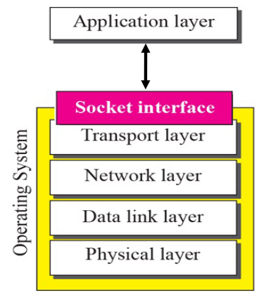
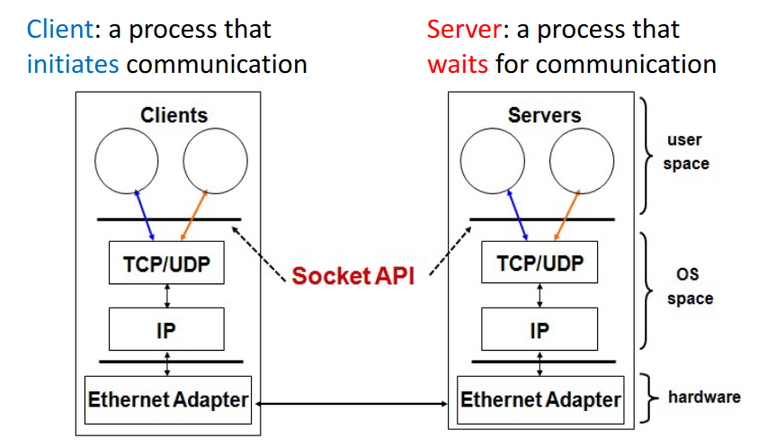
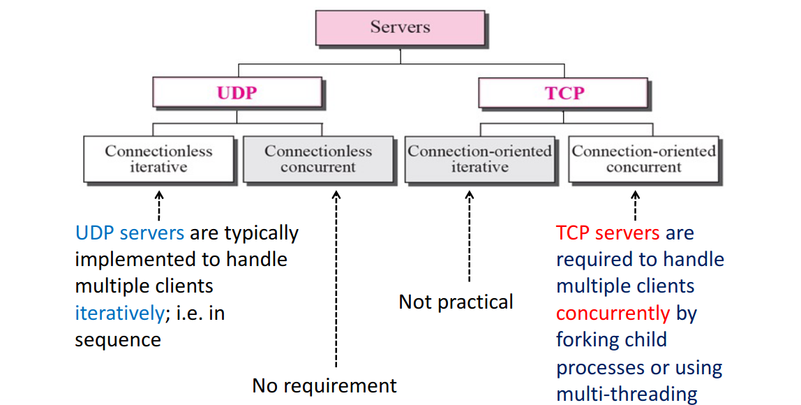
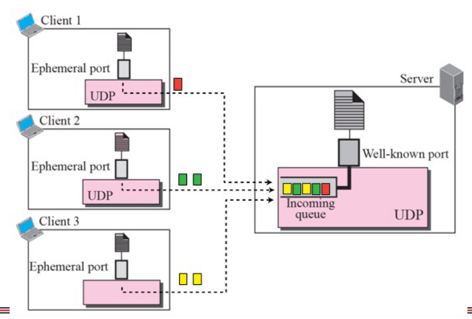
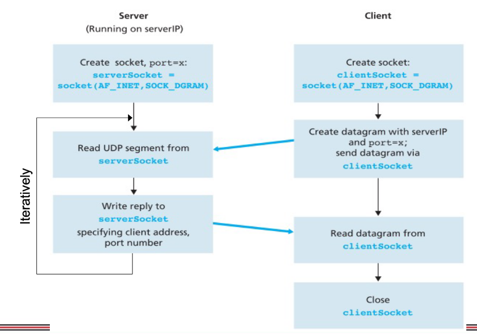
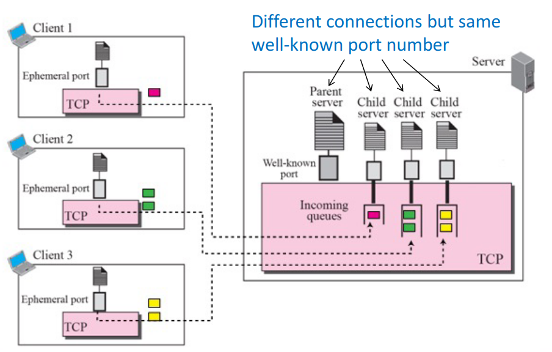
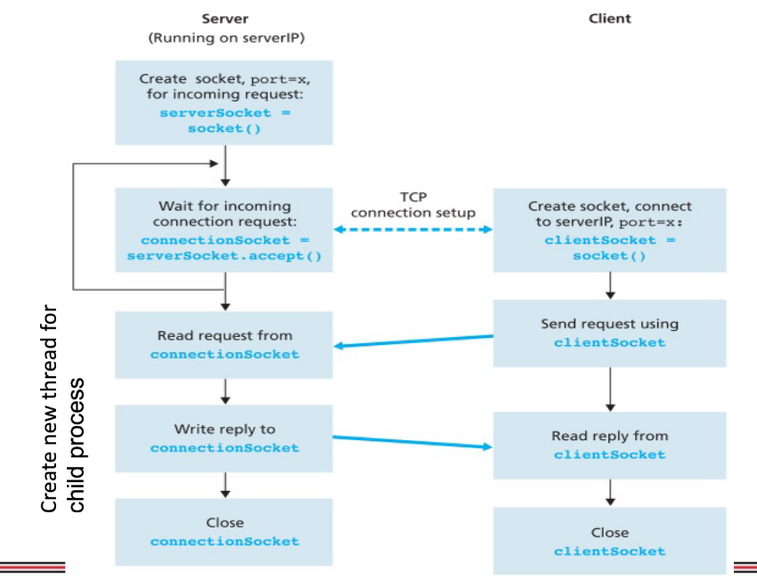
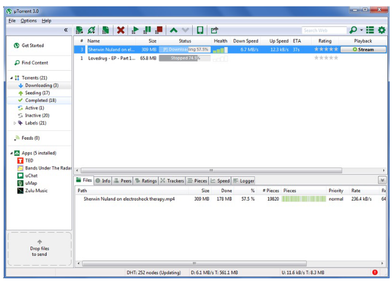
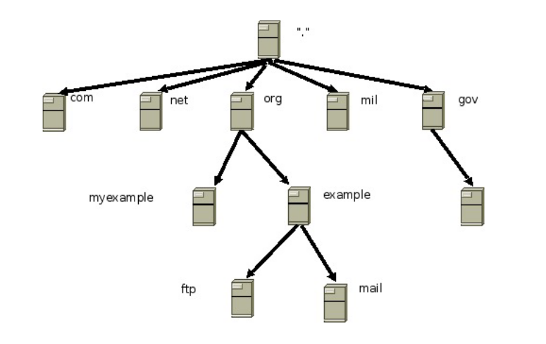

# Interface to Transport Layer - Socket APIs for Programming Network

- [Interface to Transport Layer - Socket APIs for Programming Network](#interface-to-transport-layer---socket-apis-for-programming-network)
  - [Socket Programming](#socket-programming)
    - [Client-Server Architecture](#client-server-architecture)
    - [Communication Channel](#communication-channel)
      - [UDP server](#udp-server)
        - [Sample Structure of UDP Client Program(Python)](#sample-structure-of-udp-client-programpython)
        - [Sample Structure of UDP Server Program(Python)](#sample-structure-of-udp-server-programpython)
      - [TCP Server](#tcp-server)
        - [Sample structure of TCP Client Program(Python)](#sample-structure-of-tcp-client-programpython)
        - [Sample structure of TCP Server Program(Python)](#sample-structure-of-tcp-server-programpython)
    - [TCP Application Example - BitTorrent](#tcp-application-example---bittorrent)
    - [UDP Application Example - Domain Name Server(DNS)](#udp-application-example---domain-name-serverdns)


## Socket Programming
With the benefit of networking layering, writing **network applications** is simplified to just calling **socket APIs** to send/receive messages over the Internet.

**Socket APIs** enables network applications to use the **services** of **transport layer** to communicate over the Internet without having to re-create them in the application.

Layer 4 and below provide the services to all network applications, and is only needed to be implemented once, typically as part of OS nowadays.



---

### Client-Server Architecture
Specifically, **network applications** which are often written using **client-server architecture** consisting of client and server will call the socket APIs to establish a communication channel.

Client:
- A process that **initiates** communication

Server:
- A process that **waits** for communication

Peer-to-peer application basically implements both the client and server processes in the same host.



---

### Communication Channel
Technically speaking, a communication channel is uniquely identified by a **client socket** and the **transport protocol**(UDP / TCP).

1. By definition, a **socket** is a communication endpoint formed by the combination of an **IP address** and a **port number**.

In general, server programs for UDP are implemented using **connectionless iterative** whereas server programs for **TCP** are implemented using **connection-oriented concurrent**.

- **UDP servers** are typically implmented to handle multiple clients **iteratively**; i.e. in sequence.
- **TCP servers** are required to handle multiple clients **concurrently** by forking child processes or using multi-threading.



---

#### UDP server
**UDP servers** can be written to handle datagrams from multiple clients in sequence **iteratively** because UDP is **connectionless**.



---

A typical interaction between **UDP connectionless iterative server** and a **UDP client**.



---

##### Sample Structure of UDP Client Program(Python)
```
from socket import *        # Include the Python Socket Lib

# Open client UDP socket with ephemeral port number allocated by OS 
# (Initialize connection)

clientSocket = socket(AF_INET, SOCK_DGRAM)      #Define UDP/TCP

# Send UDP request to server
# (Send data)
message = raw_input('Input lowercase sentence:')
serverName = '127.0.0.1'
serverPort = 1023
clientSocket.sendto(message(serverName, serverPort))

# Receive UDP reply from server
# (Receive data)
bufferSize = 2048
modifiedMessage, serverAddress = clientSocket.recvfrom(bufferSize)
print(modifiedMessage)

# Close UDP Port
# (Close connection)
clientSocket.close()
```

Potential Issues:
1. (Send data): Client never knows if server receieved the data or not
2. (Receive data): Client might wait for sometime ... but ...
3. (Close connection): In fact you need not to close connection, why? why not?

##### Sample Structure of UDP Server Program(Python)

```
from socket import *            #include the python socket lib

# open UDP server socket to listen at well-known port
# (Initialize to listen to a port)
serverPort = 1023
serverSocket = socket(AF_INET, SOCK_DGRAM)      # Define UDP / TCP
serverSocket.bind(('', serverPort))
print("The server is ready to receive ")

# Process iteratively
bufferSize = 2048
while 1:

    # Wait to receive UDP request from client
    # (Receive data)
    message, clientAddress = serverSocket.recvfrom(bufferSize)

    # Process client request
    modifiedMessage = message.upper()

    # Send UDP reply to client
    # (Send data)
    serverSocket.sendto(modifiedMessage, clientAddress)
```
Potential Issues:
1. (Receive data): How the server handle multiple connections like TCP?
2. (Send data): The server also does not know if the client received the data


#### TCP Server
In contrast, TCP is connection-oriented. To be able to handle multiple clients concurrently, TCP servers must be written to **forck child processes** or be **multi-threaded**



---

A typical interaction between a TCP connection-oriented concurrent server and a TCP client.



---

##### Sample structure of TCP Client Program(Python)

```
from socket import *            # include the python socket lib

# Initiate 3-way handshake TCP Connection with server
# (Initialize connection)
serverName = '127.0.0.1'
serverPort = 1023
clientSocket = socket(AF_INET, SOCK_STREAM)     # Define UDP / TCP
clientSocket.connect((serverName, serverPort))

# Send TCP byte stream to the server
# (Send data)
sentence = raw_input('Input lowercase sentence:')
clientSocket.send(sentence)

# Receive TCP byte stream from server
# (Receive data)
bufferSize = 2048
modifiedSentence = clientSocket.recv(bufferSize)
print('From Server: ', modifiedSentence)

# Close TCP Connection
# (Close connection)
clientSocket.close()
```
Potential Issues:
1. (Initialize connection): If 3-way handle cannot established?
2. (Send data): Server cannot receive, then?
3. (Receive data): Client cannot receive, then?
4. (Close connection): Not close connection, what will happen?

##### Sample structure of TCP Server Program(Python)

```
from socket import *            # include python socket lib
from threading import Thread    # include thread lib

def child(connectionSocket):
    # receive TCP byte stream from client
    # (Receive data)
    sentence = connectionSocket.recv(2048)
    capitalizedSentence = sentence.upper()

    # send TCP byte stream to client
    # (send data)
    connectionSocket.send(capitalizedSentence)

    # close TCP connection with client
    # (close connection)
    connectionSocket.close()

# open TCP socket to listen at well-known port
# (Initialize to listen a port)
serverPort = 1023
serverSocket = socket(AF_INET, SOCK_STREAM)     # Define UDP/TCP
serverSocket.bind(('', serverPort))
serverSocket.listen(1)
print('The server is ready to receive')

# Process concurrently using multi-threading
# (Accept the connection, create a thread to handle)
while 1:
    # wait to establish 3-way handshake TCP connection with client
    connectionSocket, addr = serverSocket.accept()

    # start a new thread to handle child process
    t = Thread(target=child, args=(connectionSocket, ))
    t.start() 
```

### TCP Application Example - BitTorrent
BitTorrent is one of the example to show how TCP is using as well as application layer to handle file downloading.



---

### UDP Application Example - Domain Name Server(DNS)



---
