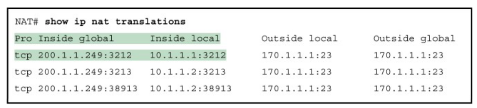

# Interim Solution to IPv4 Address Exhaustion

- [Interim Solution to IPv4 Address Exhaustion](#interim-solution-to-ipv4-address-exhaustion)
  - [Agenda 6a](#agenda-6a)
  - [Background](#background)
    - [IPv4 Depletion](#ipv4-depletion)
  - [Network Address Translation(NAT)](#network-address-translationnat)
    - [Inside Global, Inside Local, Outside Local and Outside Global](#inside-global-inside-local-outside-local-and-outside-global)
    - [3 Types of NAT](#3-types-of-nat)
    - [Static NAT](#static-nat)
      - [Static NAT Translation Table](#static-nat-translation-table)
    - [Dynamic NAT](#dynamic-nat)
      - [Wildcard Mask](#wildcard-mask)
      - [Dynamic NAT Translation Table](#dynamic-nat-translation-table)
    - [Port Address Translation(PAT)](#port-address-translationpat)
      - [NAT Translation Table](#nat-translation-table)
      - [NAT Pool Overload (A variation of PAT)](#nat-pool-overload-a-variation-of-pat)
  - [Agenda 6b](#agenda-6b)
    - [IPv4 over Ethernet](#ipv4-over-ethernet)
    - [IP Broadcast](#ip-broadcast)
    - [IP Multicast](#ip-multicast)
    - [IP Unicast Messages](#ip-unicast-messages)
      - [Routing: Unicast Destination Senarios](#routing-unicast-destination-senarios)
    - [ARP Request](#arp-request)
    - [ARP Reply](#arp-reply)
    - [ARP Cache](#arp-cache)
    - [ARP Summary](#arp-summary)
  - [Agenda 6c](#agenda-6c)
    - [Internet Control Message Protocol(ICMP/RFC 792)](#internet-control-message-protocolicmprfc-792)
      - [ICMP over IP](#icmp-over-ip)
      - [ICMP Messages](#icmp-messages)
      - [ICMP Request & Reply](#icmp-request--reply)
      - [ICMP Ping](#icmp-ping)
      - [Standard Ping](#standard-ping)
      - [Extended Ping](#extended-ping)

## Agenda 6a
1. **Private addresses** and **Network Address Translation(NAT)** as an interim solution for IPv4 address exhaustion.
2. **Network Address Translation(NAT)** to translate **private IP** addresses(not valid in the Internet) to **public IP** addresses(valid in the Internet)
3. Types of NAT:
   - Static NAT
   - Dynamic NAT
   - Port Address Translation(PAT) or NAT pool overload

## Background
### IPv4 Depletion
Today, IANA/RIRs have run out of IPv4 addresses, and many homes and even enterprises are only able to get one or few IP addresses through their ISP to access the Internet.

So where to get IP Addresses for all hosts and devices in every home and enterprise?

Fortunately, IANA has defined **3 blocks** of **private IP addresses(RFC 1918)** that anyone can use for their internal networks but these addresses are not valid on the Internet. 

Different home and enterprise networks can use the **same IPv4 private addresses** because these addresses will NOT be forwarded out to the Internet.

## Network Address Translation(NAT)
To enable users of private IP addresses to access the Internet, the interim solution of Network Address Translation(NAT / RFC 3022) is developed.

**NAT** is typically implemented at **edge router** to change the packet's **source private IP address** with the router's public address, and vice versa.

### Inside Global, Inside Local, Outside Local and Outside Global
in Cisco routers, the terms Inside Global, Inside Local, Outside Local and Outside Global are used to describe NAT translation as shown.

### 3 Types of NAT
1. Static NAT
   - one-to-one mapping of private IP address and public IP address statically 
2. Dynamic NAT
   - Pool of available addresses assigned **dynamically**
3. Port Address Translation(PAT) or NAT overload
   - Support many local hosts **concurrrently** with only one or few public IP addresses

### Static NAT
1. Static NAT provides a one-to-one mapping between private IP address and public IP address statically
2. Static NAT is usually deployed to allow access to inside servers from the outside Internet.

\

Example of configuring static NAT in Cisco Router

#### Static NAT Translation Table
After configuring static NAT, the entries are immediately updated into the **NAT Translation table**, ready to translate between configured pricate IP to public IP and vice versa.

Due to static entries in NAT table, **outside hosts** are able to **initiate** a connection to **inside hosts** with private IP; e.g. server 170.1.1.1 can initiate a ping to 200.1.1.1 to reach inside host 10.1.1.1 as shown in the NAT table.

### Dynamic NAT
1. Dynamic NAT maps a private IP Address to a public IP within a **pool** of available addresses **dynamically** when needed. The public IP will be returned when not in use.
2. **NAT pool addresses** are allocated on a first-come-first-serve basis, and once all are used, other inside host will temporarily not able to access the Internet.

Example of configuring dynamic NAT in Cisco Router

#### Wildcard Mask
In the configuration of access-list command, note that instead of the usual subnet mask, wildcard mask is used to specify the subnet blocs addresses.

Subnet mask and wildcard mask are two different ways of specifying a range of IP. **Wildcard mask** works inversely as follow:
- 0: match this bit in the address
- 1: ignore this bit in the address

A **shortcut** way to find wildcard mask is to subtract subnet mask from 255.255.255.255.

#### Dynamic NAT Translation Table
After configuring dynamic NAT, no entry is added into NAT table which will prevent outside hosts from initiating connection to inside hosts with private IP.

For dynamic NAT, only **inside hosts** are able to **initiate** connections to **outside hosts**' e.g. when client 10.1.1.1 initiates ping to server 170.1.1.1, an IP of NAT pool will be assigned and an entry added into NAT table, allowing packets returning to client.

After a period of inactivity, dynamic entry will timeout and be removed, and the IP returns to the NAT pool.

### Port Address Translation(PAT)
1. Port Address Translation(PAT) or NAT pool overload which can support many local hosts concurrently with only one or few public IP addresses.
2. PAT is controversial as it requires **layer-3 router to be enhanced** with capability to read/amend **16-bit port number** at **layer-4 transport layer** header.

With PAT, one public IP address can theoretically support up to $2^16$ = 65536 private IP Addresses.

An example of configuring PAT using only one IP in Cisco router

#### NAT Translation Table
Similar as dynamic NAT, no entry is added into NAT table after configuring PAT, thus preventing outside hosts initiating connection to inside hosts.

When **inside host initiate** connection to **outside hosts**, entries will be added into NAT table, thus allowing returning packets.
- Note:
  - The use of **same IP address** but **different port numbers** to support different inside hosts concurrently.

#### NAT Pool Overload (A variation of PAT)
A variation of PAT is **NAT pool overload** which configures a pool of IP Addresses for PAT.

## Agenda 6b
Resolving IPv4 Address to MAC Address - Address Resolution Protocol(ARP)
1. IPv4 over Ethernet
2. IP Broadcast, Multicast, Unicast senarios
3. ARP Request & ARP Reply

### IPv4 over Ethernet
To forward packets from **source to destination**, IP must still use the service **data link layer**. 

But how can IP packets be carried over Ethernet **without knowing destination MAC address**?

### IP Broadcast
For **IP Bradcast** messages, the **Ethernet broadcast** address FF-FF-FF-FF-FF-FF will be used as the destination MAC Address.

### IP Multicast
For IP multicast messages, the **IP Multicast Address** will be translated to **Ethernet Multicast Address**

### IP Unicast Messages
For IP unicast messages, how does the source host determine the destination host for MAC address?

#### Routing: Unicast Destination Senarios

ARP before sending unicast IP over Ethernet

Before sending unicast IP over Ethernet, ARP(Address Resolution Protocol) is developed for source host or routers to resolve **target** IP address to **target** MAC address.

### ARP Request
Essentially, ARP consists of an ARP request for a MAC address corresponding to a requested target IP address.

ARP request is **broadcast**:

### ARP Reply
The host or routers with the matching target IP address will then respond with an ARP reply with the corresponding MAC Address.

ARP reply is **unicast**:

### ARP Cache
To avoid constantly runing ARP which will be inefficient, each host and router maintains its ARP cache containing **recent** mappings of **IP address/MAC address**.

.png)

Dynamic entries are learn dynamically, which will be removed automatically if not being referenced again; e.g. 2 minutes, to ensure ARP cache entries are up-to-date.

### ARP Summary
In summary, as the IP packets is carried hop-by-hop from source to destination, the **destinatnion IP remains the same**, but the **destination MAC address changes**.

## Agenda 6c
A Related Prorocol to IP - Internet Control Message Protocol(ICMP)
1. ICMP over IP
2. ICMP Messages
   - ICMP Request & Reply
3. Standard Ping vs Extended Ping

### Internet Control Message Protocol(ICMP/RFC 792)
At the network layer, there is a related protocol to IP called **Internet Control Message Protocol(ICMP)** which enables IP to **report error** or **perform query**.

Although IP is providing unreliable service, it can be useful for **routers** or **destination host** to be able to provide **error feedback** to the **source host**; e.g. Destination unreachable.

Note that ICMP Messages are used to provide feedback about problems in the network, but **NOT to make IP reliable**.

#### ICMP over IP
Note that ICMP messages are sent over IP packets which in turn are sent over data link layer such as Ethernet.

#### ICMP Messages
Broadly, ICMP messages may be classified into **error-reporting** and **query messages**.

Below are some of the common types of ICMP messages. Refer to the full list in RFC 792 and RFC 6918.

#### ICMP Request & Reply
An example of ICMP query message is the **echo request** message sent by a **source host** to query a router or destinatnion host, which will respond with an echo reply message.

#### ICMP Ping
The ping troubleshooting tool that you've been using in the labs to test the connectivity of a host or router is in fact implementing using ICMP echo/reply messages.

#### Standard Ping
By default, when you issue a ping from the router, it will send a standard ping which is using its **outgoing interface IP** as the **source IP** of the ping message.

You may have noticed that sometimes the first ping failed. This is due to the ARP table not having the MAC Address initially.

#### Extended Ping
Alternatively, you may also issue an extended ping which allows you to select **other interface IP** of the ping message.

For example, to test whether PC B is able to reach subnet 172.16.1.0/24, you can issue an extended ping from the router choosing interface IP 172.16.1.1 as the source IP of the ping.

An example of issuing extended ping from the router

