# Dynamic Routing Protocols

- [Dynamic Routing Protocols](#dynamic-routing-protocols)
  - [Classification of Routing Protocols](#classification-of-routing-protocols)
  - [Link State Routing](#link-state-routing)
  - [What is a protocol?](#what-is-a-protocol)
  - [What is a Routing Protcol](#what-is-a-routing-protcol)
  - [Control and Data Plane](#control-and-data-plane)
    - [Per router control(traditional)](#per-router-controltraditional)
    - [Lgically centralized control(sotware defined networking)](#lgically-centralized-controlsotware-defined-networking)
      - [Question](#question)
  - [Routing Protocol Classifications](#routing-protocol-classifications)
    - [IGP - Interior Gateway Protocol](#igp---interior-gateway-protocol)
    - [EGP - Exterior Gateway Protocol](#egp---exterior-gateway-protocol)
  - [Autonomous System](#autonomous-system)
  - [Dynamic Routing](#dynamic-routing)
  - [OSPF - Open Shortest Path First](#ospf---open-shortest-path-first)
  - [3 Phases of OSPF](#3-phases-of-ospf)
    - [OSPF Version 2](#ospf-version-2)
    - [OSPF Phase 1](#ospf-phase-1)
      - [Single-area & Multi-area OSPF](#single-area--multi-area-ospf)
      - [Passive Interfaces](#passive-interfaces)
        - [An example of configuring and verifying passive interfaces:](#an-example-of-configuring-and-verifying-passive-interfaces)
    - [OSPF Phase 2](#ospf-phase-2)
      - [Designated Router(DR) & Backup Designated Router(BDR)](#designated-routerdr--backup-designated-routerbdr)
      - [Advertising the Default route in OSPF](#advertising-the-default-route-in-ospf)
    - [Phase 3](#phase-3)
      - [Configure reference-bandwidh](#configure-reference-bandwidh)
  - [Summary](#summary)


## Classification of Routing Protocols
1. Interior Gateway Protocol (IGP)
2. Exterior Gateway Protocol (EGP)

## Link State Routing
- **Open Shortest Path** (OSPF)
- OSPF Operation:
  - Discover adjacent neighbours
  - Advertise own subnet and learn subnet from others
  - Compute shortest path route based on interface cost to reach a subnet using Dijkstra's algorithm

## What is a protocol?
- A protocol is a set of rules that governs the communication between computers on the network
- Internet communication protocols are published by the Internet Engineering Task Force (IETF)

## What is a Routing Protcol
A Routing protocol specifies how **routers communicate** with each other.

    Router#show protocols       // shows all the protocols available
    Router#show ip protocols    // shows ip specific protocols, which is routing protocol

A router **automatically** learns the route to other subnets or networks with the use of **routing protocol** at the **control plane**.
- Note: whenever we talk about routing protocol, we are talking about dynamic routing. Where only dynamic routing are configured by routing protocol.

## Control and Data Plane
Functionally, a router may be considered to comprise of **Two Planes**:
- **Control Plane** controls the behaviour of **data plane**.
- I.e. Deriving and updating the **routes** which will affect how the dataplane forwards the packets. 
- **Data Plane** forwards packets based on the **fowarding/routing table**.
- Note:
  - Data Plane does the action
  - Control Plane acts a the brain and determines the routes
  - The routing protocol is essntially running in the control plane


Command:

    Router#show ip route    // to show the routing table

- Routing: Determine route taken by packets from source to destination (control plane)
- Forwarding: Move packets from router's input to appropriate router output (data plane)
- Note:
  - The input & output can also be known as Ingress/Egress | Inbound Traffic/Outbound  Traffic

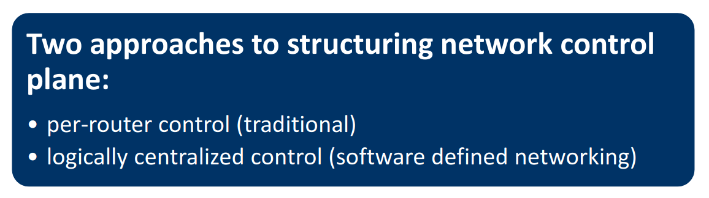
 
### Per router control(traditional)
- each router has one control plane
  - i.e. Router 1 has control plane 1, Router 2 has control plane 2

- Indidual routing algorithm components  each and every router interacts in the control plane.

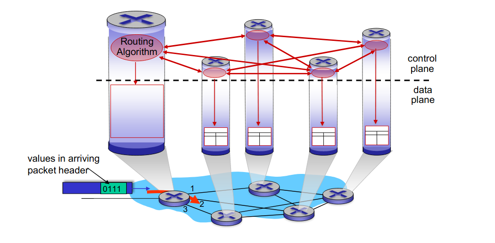

- The routing table itself exist on the data plane. (However the table entries are updated by the control plane which is by the routing algorithm)
- The routing algorithm are computed by all the routers, then the final route is then updated into the routing table.
- Based on the routing table, whenever packet comes in, the router will refer to its routing table and send it out accordingly. 
  
Step by Step:
1. A packet comes to the router. The packet will be opened up to see the ip header information(which contains the soure and destination IP)
2. Look into the routing table based on the destination IP address. Then forwarded accordingly based on the routing table.

### Lgically centralized control(sotware defined networking)
- 1 centralized control plane managing multiple routers

#### Question
Routing table is updated by the data plane? [T/F]
    - Answer: F
    - The control plane is the one updating the routing table and the data plane only forwards the packets according to the route which is given by the control plane.

## Routing Protocol Classifications

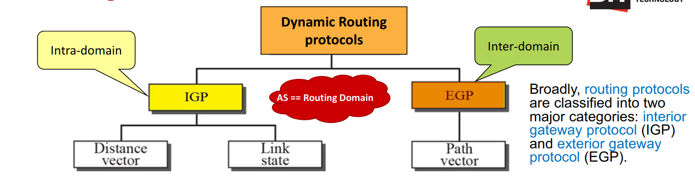
Note: 
- Distance vector: RIP (Mainly used in small enterprises)
- Link state: OSPF
- Path vector: BGP

### IGP - Interior Gateway Protocol
- IGP is designed to run inside a **single autonomous system** (AS)
  - i.e. intra-domian
- Different AS may run different IGP.
  - i.e. RIP or OSPF
- Another IGP is propeitary **EIGRP** by Cisco

Types of IGP:
1. RIP - uses hops
2. **OSPF - use link state**

### EGP - Exterior Gateway Protocol
- EGP is designed for use between **different AS**.
  - I.e. inter-domain
- To communicate, all AS must run the same **EGP**
- The current de facto standard is **BGP**.

## Autonomous System
An Autonomous System (AS) is a group under the administration of a single authority, i.e. within an ISP or within an organization.

- Each AS is identified by a unique AS number(ASN) assigned by IANA (Internet Assigned Number Authority)
- We can think Autonomous system as some routing domain. Within a domain (network/subnet), it has it s own routing algorithm.
- Specifically, an AS is what we call a large group of networks that have a uniformed policy(has the same routing policy/protocol). 
- Each AS has its own routing policy and routing protocols. 


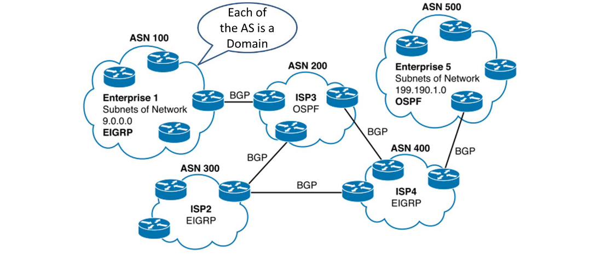

## Dynamic Routing
Routing protocol goal:
- determine "good" paths (equivalently, routes), from sending hosts to receiving host, through network of routers.
  - path: sequence of router packets traverse from given initial source host to final destination host
  - "good": least cost, fastest, least congested (load balancing)
    - The cost can be based on the hops or link state

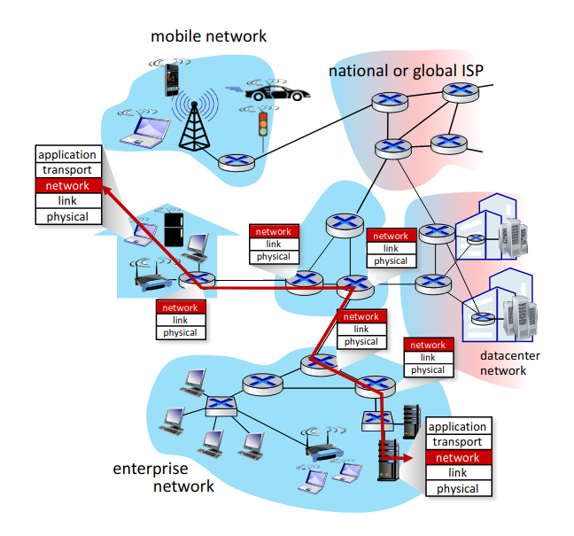

## OSPF - Open Shortest Path First
OSPF is an interior gateway dynamic routing protocl based on **Link State Routing**
- Link state Metric
  - Minimum delay (rtt)
  - Maximum throughput, reliability, etc ... 
- Uses Dijkstra's Algorithm to compute the routing tables

## 3 Phases of OSPF
1. **Discover** adjacent neighbours by multicasting "Hello" message.
2. **Advertise and learn** network tology by exchanging **link state advertisements**(LSAs) - Learn & maintain in link state database (LSDB) :
   - when requested;
   - when link state changes;
     - e.g. goes up / come down 
   - when aging timer expires (default 30mins)
3. **Compute shortest path** to other subnets by running **Dijkstra's Algorithm** on the LSDB

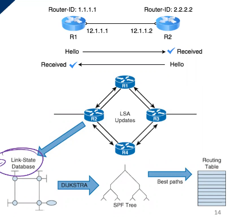

### OSPF Version 2
The current version of OSPF for IPv4 is version 2 denoted as OSPFv2. The OSPF protocol message is carried directly by IP layer using multicast destination IP address to OSPF routers. 

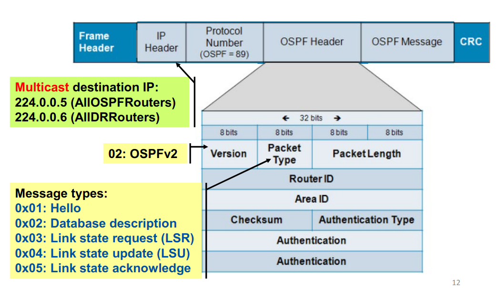

### OSPF Phase 1
Discover adjacent neighbours. When a router is enabled to run OSPF, it will multicast a Hello message to neighbouring routers to announce its presence in the network.
- Every router is identified by a unique router ID (RID) which is sent inside the Hello message.

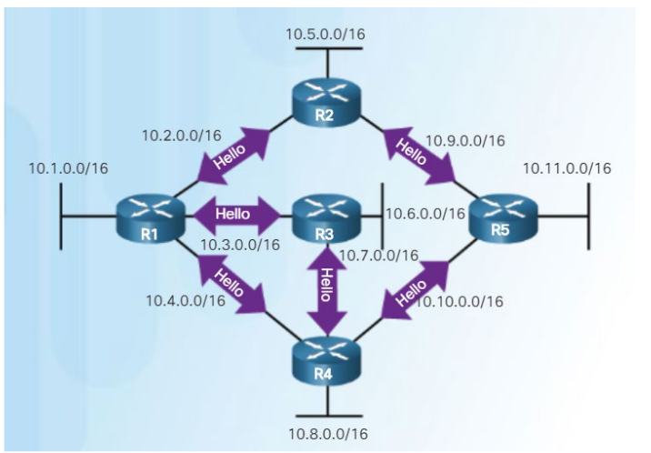

In Cisco router, OSPF is enabled with the router command, and the interface must also be indirectly enabled to run OSPF with the network command as shown:

    R1# router ospf 1                                       //Enable OSPF in router, 1 is process ID
    R1(config-router)# network 10.2.0.0 0.0.255.255 area 0  //Wild card mask instead of subnet mask used
    R1(config-router)#network ...
    R1(config)# do show ip ospf                             // To see the OSPF configurations in Router

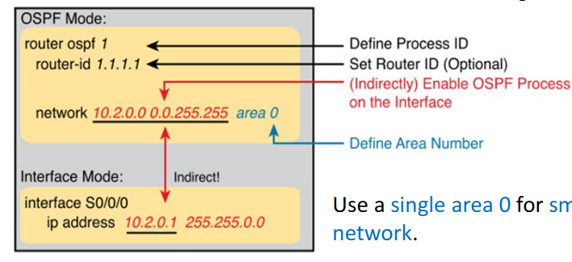
- Use a single area 0 for small network
- Process ID
  - Any integer between 1 to 65535. It is only used locally to identify the OSPF and has no meaning to other routers on the network.

The Configuratio of router ID is optional and is determined in order of precedence as follows:
1. If the optional router-id OSPF subcommand is configured, this value is the router ID:
     - `R1(config)# router ospf 1`
     - `R1(config-router)# router-id 1.1.1.1`

2. Else if the loopback interface of the router is configured with IP addresses, the highest IP address among these is the router-id
3. Else among the IP addresses configured on the physical router interfaces, the highest IP address among these is the router-id.

To verify router-id, use the commmand:

  R1# show ip ospf    //Show ospf configured in the router

To update the router-id if it has been set before:

  R1# clear ip ospf process   //type y to proceed


#### Single-area & Multi-area OSPF
Single-area OSPF for small networks:

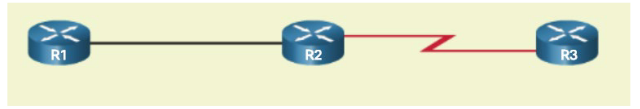

Multi-area OSPF for large networks, typically with 50 or more routers (not covered in this module)

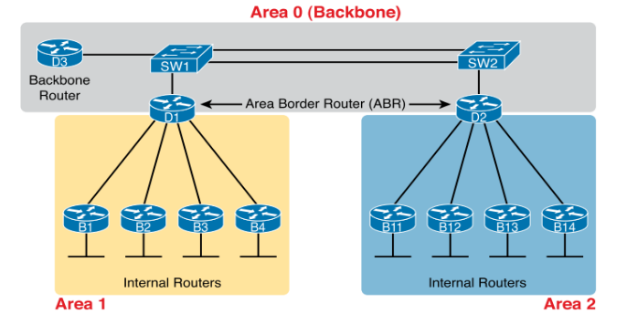

- To be scalable, OSPF has introduced the idea of area ID.
- For small networks, it's sufficient to configure all routers under the same area (usually area 0) called single-area OSPF.

#### Passive Interfaces 
For **security** and **avoid wasting bandwidth** sending Hello messages, interfaces that have no neighboring router are recommended to be configured as **passive interfaces**.

Configured on those interfaces which are not connected to another router.(Includes when connected to a PC or switch)

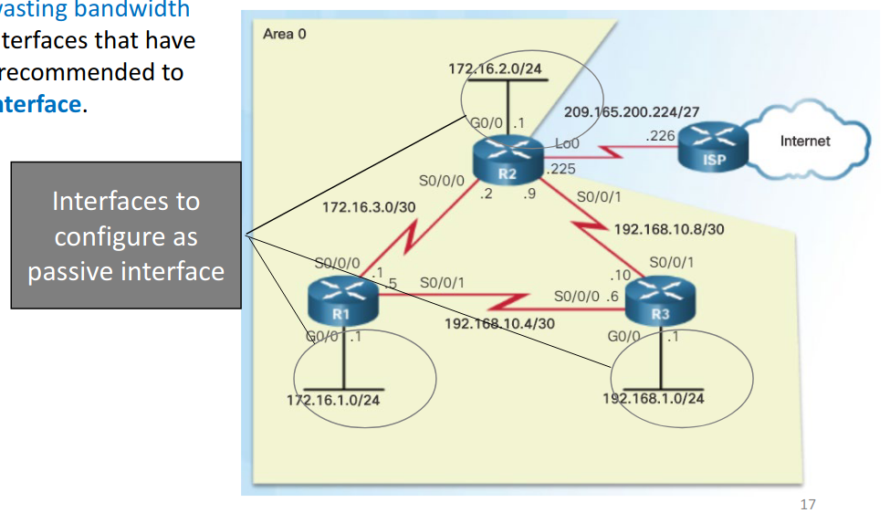

##### An example of configuring and verifying passive interfaces:

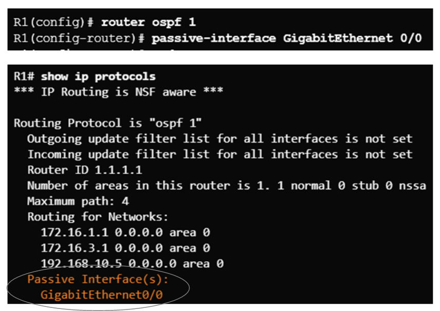

After enabling OSPF and Hello messages are exchanged, the router will transmit to 2-way state, ready to start exchanging route information.
- Note:
  - Every router continues to send Hello messages periodically at a interval called **Hello Interval**(default 10s). If Hello message is not received after a time interval called **Dead Interval** (default 4 times of Hello Interval), the neighbor is considered down.

Command to show ospf neighbor:

  Router# show ip ospf neghbor

---
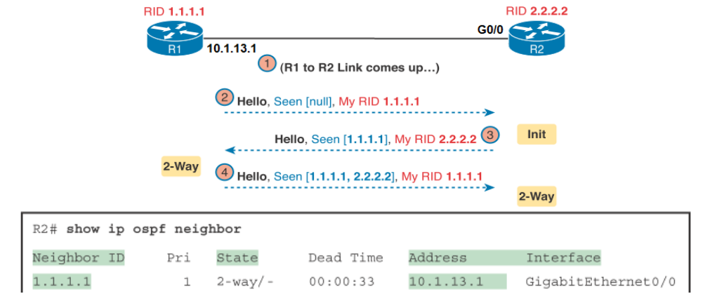

### OSPF Phase 2
Every OSPF router maintains a link state database(LSDB) which initially only contains link state advertisements(LSA) about e subnets directly conceted to it and costs.

For example, LSDB containing inital LSA at router R1

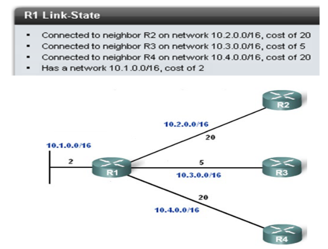

Continuing from 2-way state in Phase 1, the OSPF router will start exchanging route information using DD, LSR and LSU messages and transit to loading and then full state when done in Phase 2.

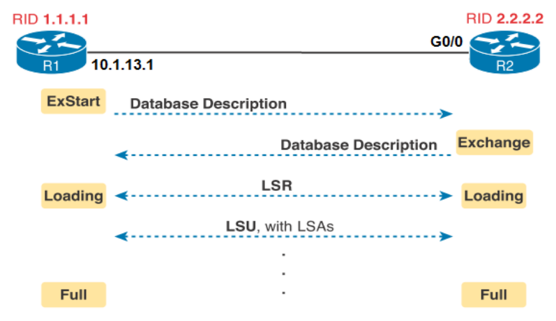

1. Database Description(DD): Summary list of available LSA, not details
2. Link State Request(LSR): Askingfor LSA it does not have
3. Link State Update(LSU): Send LSU containing required LSA

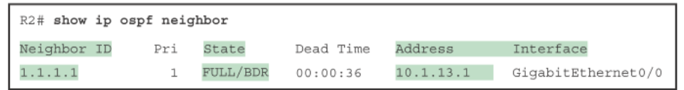

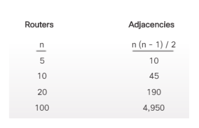

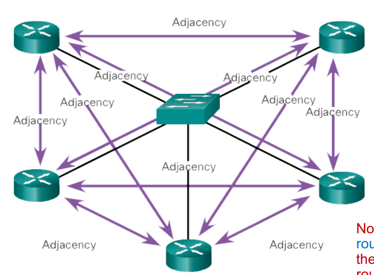

Note:
- Note that in Ethernet, there may be multiple routers connected to the same subnet, and the exchanging of LSU/SA between adjacent routers can be excessive.

#### Designated Router(DR) & Backup Designated Router(BDR)
- DR: Receive LSAs from routers and flood to other routers in the subnet.
- BDR: To take over if DR fails.
- DROTHER: All other routers that are not DR or BDR.

To reduce the number of LSU/LSA exchanged, the concept Designated Router(DR) and Backup Designated Router(BDR) are introduced.

The DR acts as a central manager that manages the updates and advertise between the routes. While it manages the route, it parallely synchronises with the BDR such that when the DR fails, the BDR can instantly take over.

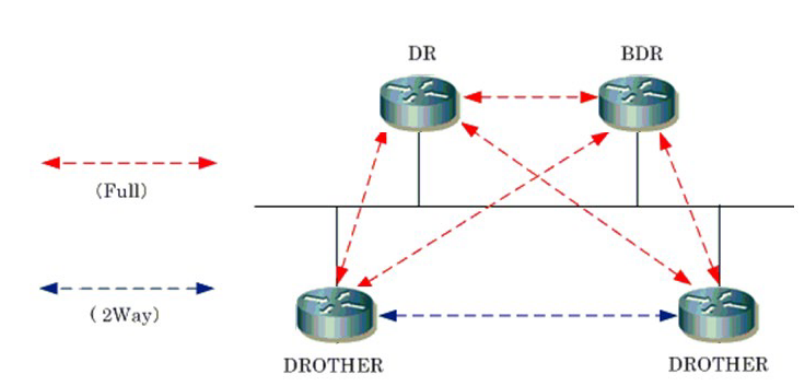

Based on (1) priority and (2) router ID, the highest will be elected as DR and the second highest as BDR.

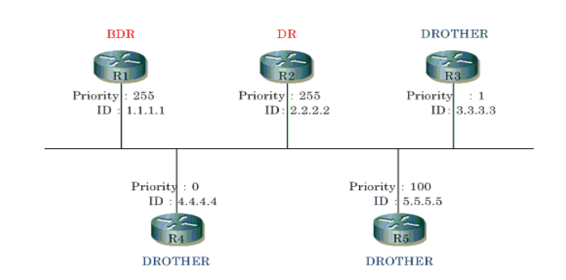

Configuring priority:

  R1(config)# interface g0/1
  R1(config-if)# ip ospf priority 255

- Note:
  - Default priority: 1
  - Priority 0: never take over DR/BDR
  - Once elected has completed, new routers entering the subnet do not take over DR/BDR even if they have higher priority/RID.
  - In OSPF, higher prioriy number = higher chance of being elected as the DR

#### Advertising the Default route in OSPF

For example, it is useful for R1 to advertise default route so that routers B1,B2 and B3 can dynamically learn the default route and forward all traffic to Internet to R1.

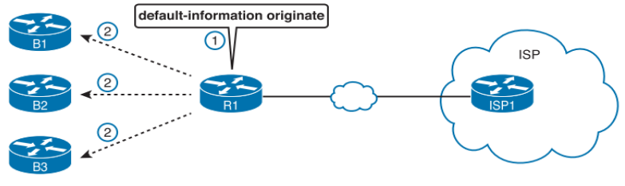

By default, OSPF does not advertise default route 0.0.0.0 0.0.0.0 but can be configureto do so via the following command

Advertise default route if it's working:

    R1(config)# router ospf 1
    R1(config-router)# default-information originate

Advertise default route even if it's(the interface) down:

    R1(config)# router ospf
    R1(config-router)# default-information originate always

After exchanging the LSAs, every router will eventually have the same LSDB containing the complete topology of the network.

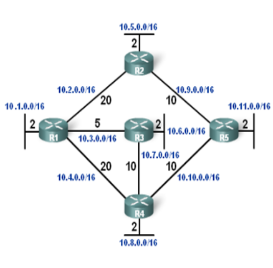

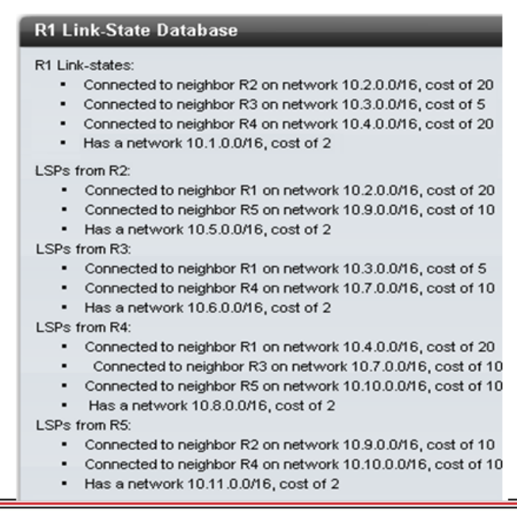

### Phase 3
With the LSDB fully updated, each router can proceed to use Dijkstra's algorthm to compute the shortest path from itself to other subnets.

For example at R1:

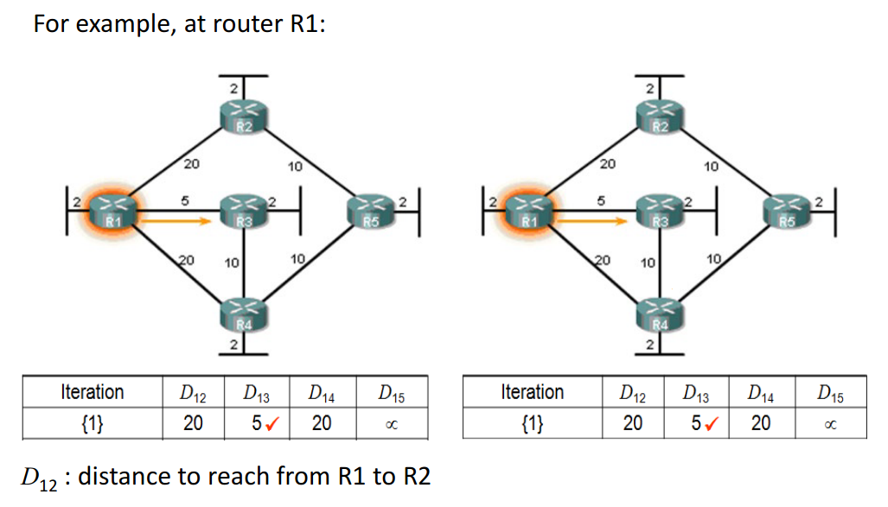

Dijkstra's Algorithm to compute the shortest path:

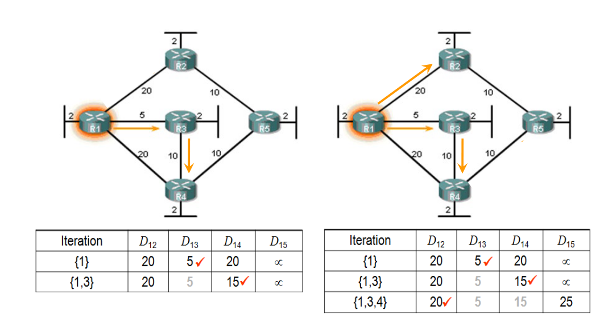

Finally, each router will use the result of Dijkstra's Algorithm to update its routing table.

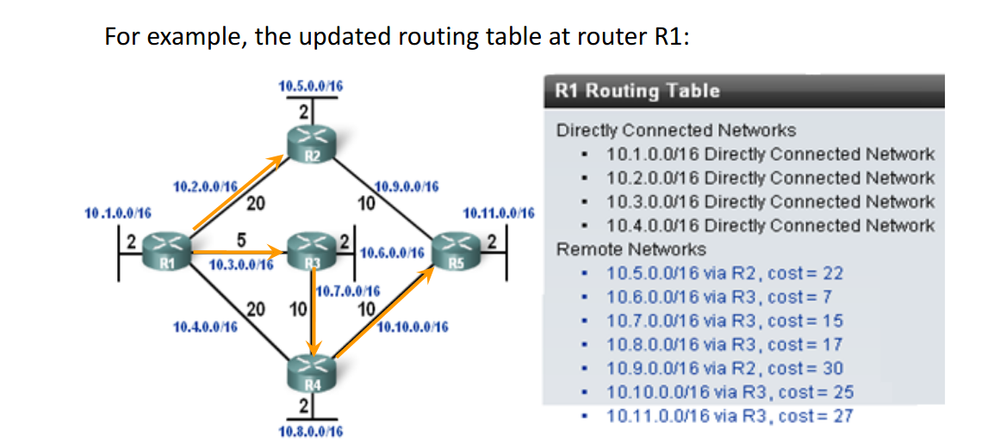

An example of R1 routing table being updated with routes learned by OSPF:

- The code 'O' on the left indicates routes learnde by OSPF
- The right number '/22' within the square bracket indicates the OSPF cost(total cost along the route) to reach the subnet.
- The left number '110/' within the square bracket indicateshe administrative distance.

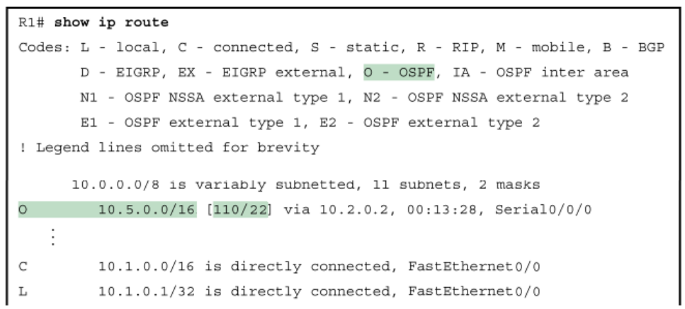

The OSPF cost tot reach a subnet is the sum of the outgoing interface cost from the router to reach the subnet. 


The default interface cost is computed based on the formula below which can be changed to influence the result of Dijkstra's algorithm:

- Computation of default interface cost:
  - reference bandwidth / interface bandwidth
  - Note: 
    - The default reference bandwidth = 100Mbps

Options to change interface cost:
1. Change reference-bandwidth:

  ```
  R1(config)# router ospf 1
  R1(config-router)# auto-cost reference-bandwidth 10000  //Measured in Mbps
  ```
    
2. Change interface-bandwidth(note that it does not change physical bandwidth)
   
  ```
  R1(config)# interface g0/0
  R1(config-router)# bandwidth 128  //Measured in kbps
  ```

3. Manually configure the desired cost on the router interface:
  
  ```
  R1(config)# interface g0/0
  R1(config-router)# ip ospf cost 5
  ```

Note that the default reference-bandwidth is 100 Mbps which will result in the same interface cost for Ethernet with 100 Mbps and above as shown:

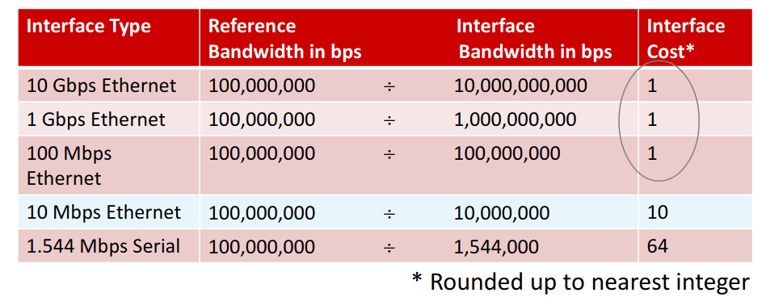

Verifying OSPF interface cost command:

  R1# show ip ospf interface brief

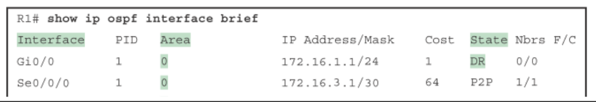

#### Configure reference-bandwidh
For example, if the fastest link speed in your network is 10 Gbps, configure:

  R1(config)# router ospf 1
  R1(config-router)# auto-cost reference-bandwidth 10000  //Measured in Mbps

In practice, it is recommended to configure the reference-bandwidth to match the fastest link speed in your network.

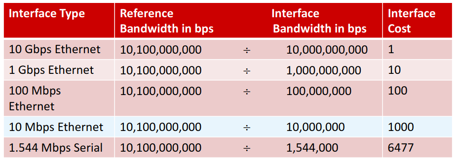


## Summary

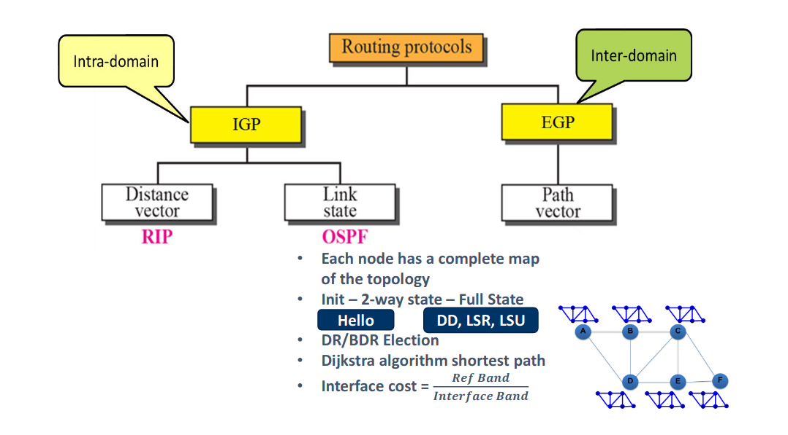