# Software Defined Networks Control and Data Plane

- [Software Defined Networks Control and Data Plane](#software-defined-networks-control-and-data-plane)
  - [Control and Data Plane in a Router](#control-and-data-plane-in-a-router)
  - [Network Layer Functions](#network-layer-functions)
    - [2 Approaches to structuring network control planes](#2-approaches-to-structuring-network-control-planes)
  - [SDN Control plane](#sdn-control-plane)
  - [SDN Centralized Control](#sdn-centralized-control)
  - [Software Defined Networking](#software-defined-networking)
  - [SDN Data-plane Switches](#sdn-data-plane-switches)
  - [SDN Controller (Network OS)](#sdn-controller-network-os)
    - [Is a Single SDN Controller Enough for a Large Enterprise?](#is-a-single-sdn-controller-enough-for-a-large-enterprise)
  - [SDN Network-Control Apps](#sdn-network-control-apps)
  - [Summary: Components of SDN controller](#summary-components-of-sdn-controller)
  - [OpenFlow Protocol](#openflow-protocol)
  - [OpenFlow: Controller-to-Switch messages](#openflow-controller-to-switch-messages)
  - [OpenFlow: Switch-to-Controller messages](#openflow-switch-to-controller-messages)
  - [OpenFlow Tables & Meters](#openflow-tables--meters)
  - [SDN: Control/Data Plane Interaction Example](#sdn-controldata-plane-interaction-example)
  - [FloodLight Controller](#floodlight-controller)
  - [Understanding OVS CLI](#understanding-ovs-cli)
  - [Open vSwitch (OVS)](#open-vswitch-ovs)
  - [Bridging the Data and Control Plane](#bridging-the-data-and-control-plane)
  - [OVS Commands for Port State & Statistics](#ovs-commands-for-port-state--statistics)
  - [Bridge - LEAF A](#bridge---leaf-a)
  - [LEAF A - Manual Flow](#leaf-a---manual-flow)
  - [Floodlight Controller REST API](#floodlight-controller-rest-api)
  - [SDN: Selected Challenges](#sdn-selected-challenges)
  - [OVS Command Reference](#ovs-command-reference)

## Control and Data Plane in a Router
Functionally, a router may be considered to comprise of **Two planes**
1. **Control Plane** controls the behaviour of **data plane**; e.g. Deriving and updating the forwarding/routing table which will affect how the data plane forwards the packets.
2. **Data plane** forwards packets based on the **fowarding/routing table**.

Individual routing algorithm components in each and every router interact in the control plane to computer forwarding tables.

- Routing table can be **Static** or **Dynamic**
- A **Dynamic routing table** is achieved by routing protocol.

## Network Layer Functions
1. Forwarding:
   - Move packets from router's input to appropriate router output (Data Plane)
2. Routing:
   - Determine route taken by packets from soure to destination (Control Plane)

### 2 Approaches to structuring network control planes
- Per-router control(traditional)
- Logically centralized control(SDN)

## SDN Control plane
Remote controller computes, install forwarding tables in routers.
- Remote Controller interacts with local control agents(CA) in routers to compute fowarding tables.

## SDN Centralized Control
1. The controller is a centralized "brain" in the network.
2. The controller will have a **global view** of
   - all the network devices
   - their interconnections
   - the best path between hosts
3. The network no longer has to converge, through multiple devices (e.g. swapping routing tables) in the network before they update their routing tables and then recalculate the preferred routes.
4. After all, the time to converge in a SDN network is as follows:
   - The time to detect a failure + the time to announce a failure to all devices + the time to run the algorithm + the time to update the database in each devices.


## Software Defined Networking
Why a logically centralized control plane?
- Easier network management: Avoid router misconfigurations, greater flexibility of traffic flows
- Table-based forwarding (OpenFlow API) allows "programming" routers
  - Centralized "programming" easier: compute tables centrally and distribute
  - Distributed "programming" more difficult: compute tables as result of distributed algorithm(protocol) implemented in each and every router
- Open (Non-proprietary) implementation of control plane
  - Foster innovation

1. Generalized "flow-based" forwarding (e.g. OpenFlow)
2. Control, Data plane separation
3. Control plane functions external to data-plane switches
4. Programmable control applications

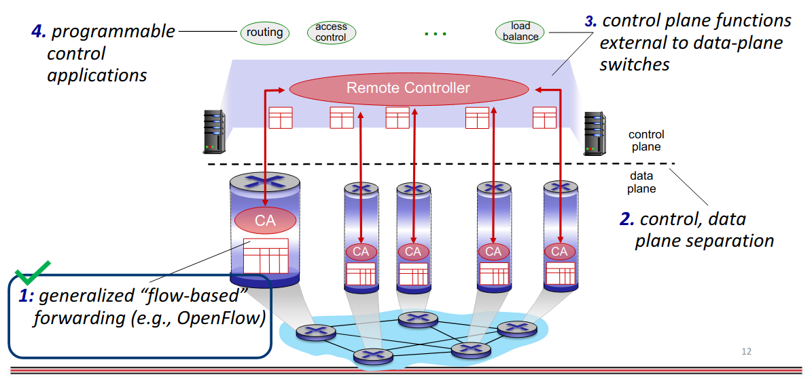

## SDN Data-plane Switches
- Fast, simple, commodity switches implementing generalized data-plane fowarding (Section 4.4) in hardware
- Flow (forwarding) table computed, installed under controller supervision
- API for table-based switch control (e.g. OpenFlow)
  - defines what is controllable, what is not
- Protocol for communicating with controller (e.g. OpenFlow)

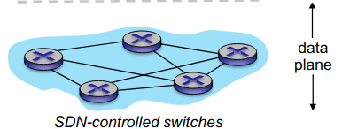

## SDN Controller (Network OS)
- Maintain network state information
- Interacts with network control applications "above" via northbound API
- Interacts with network control applications "below" via southbound API
- Implemented as distributed system for performance, scalability, fault-tolerance, robustness

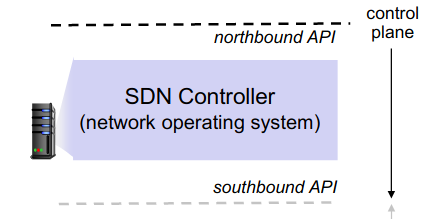

### Is a Single SDN Controller Enough for a Large Enterprise?
Distributed controller architecture:
- **Physically seperated, logically centralized** 
- Easier to **scale**
- Increased **availability** and hence improved **resilience**
- Well suited considering **geographical** perspective

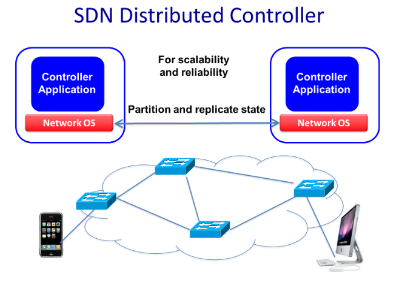

## SDN Network-Control Apps
- "Brains" of control: implement control functions using lower level services, API provided by SDN controller
- Unbundled: can be provided by 3<sup>rd</sup> party: distinct from routing vendor, or SDN controller

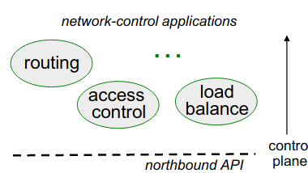

## Summary: Components of SDN controller
1. **Interface layer to network control apps**: abstractions API
2. **Network-wide state management**: state of networks links, switches, services: *a  distributed database*
3. **Communication**: communicate between SDN controller and controlled switches

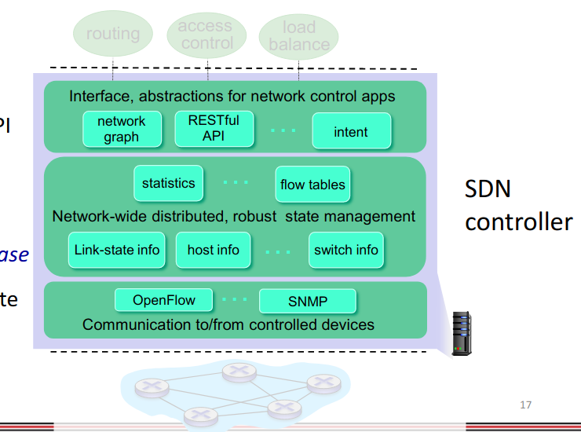

## OpenFlow Protocol
- Operates between controller, switch
- TCP used to exchange messages
  - Optional encryption
- 3 classes of OpenFlow messages:
  - controller-to-switch
  - asynchronous (switch to controller)
  - symmetric (mics)
- Distinct from OpenFlow API
  - API used to specify generalized forwarding actions

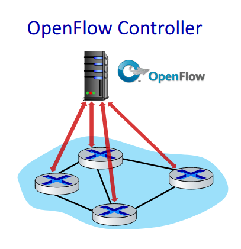

## OpenFlow: Controller-to-Switch messages
Message | Description
--- | ---
**Features** | Controller queries switch features, switch replies
**Configure** | Controller queries/sets switch configuration parameters
**Modify-state** | Add, delete, modify flow entries in the OpenFlow tables
**Packet-out** | Controller can send this packet out of specific switch port


## OpenFlow: Switch-to-Controller messages
Message | Description
--- | ---
**Packet-in** | Transfer packet (and its control) to controller. See packet-out message from controller
**Flow-removed** | Flow table entry deleted at switch
**Port status** | Inform controller of a change on a port

## OpenFlow Tables & Meters
1. An OpenFlow enabled switch communicates to an external controller over a secure OpenFlow channel
2. Lookup and packet forwarding is done according to one or more flow tables, group table, meters
3. OpenFlow Meters for QoS:
   - Guarantee maximum bandwidth for ingress traffic
   - Are applied per flow
   - Drop/DSCP Mark the excess traffic
     - Example: A meter configured with max bandwidth 1 Gbps and **Drop** action
     - Meter is applied for traffic to destination IP 10.10.10.1
     - Traffic exceeeding 1 Gbps will be dropped for example 

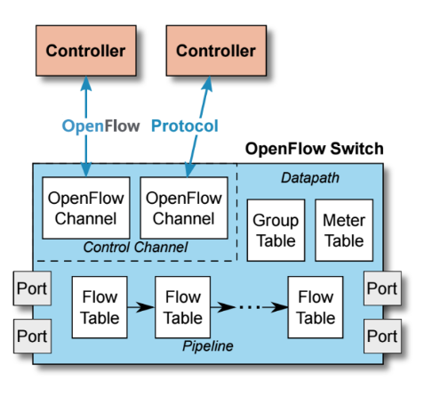

## SDN: Control/Data Plane Interaction Example
1. S1, experiencing link failure uses OpenFlow port status message to notify controller.
2. SDN Controller receives OpenFlow message, update link status info.
3. Dijkstra's routing algorithm application has previously registered to be called whenever link status changes. It is called.
4. Dijkstra's routing algorithm access network graph info, link state info in controller, computes new routes.
5. Link state routing app interacts with flow-table-computation component in SDN controller, which omputes new flow tables needed.
6. Controller uses OpenFlow to install new tables in switches that need updating
   
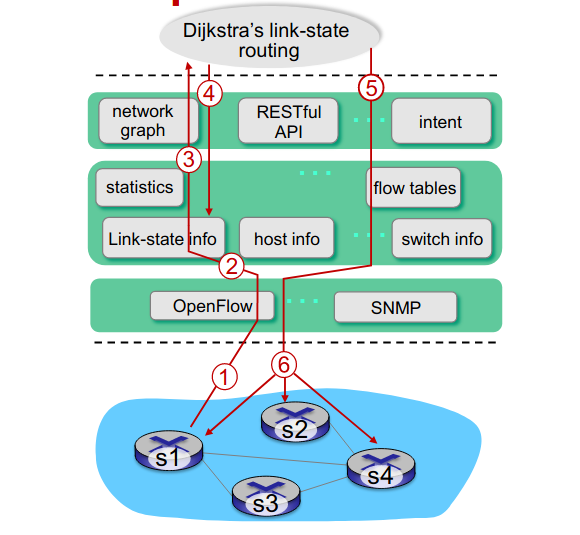

## FloodLight Controller
Service Abstraction Layer
- Interconnects internal, external applicaitons and services

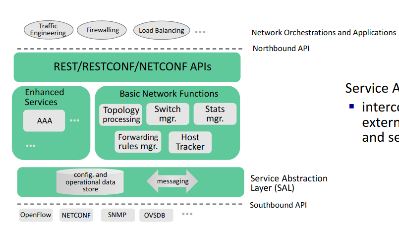

## Understanding OVS CLI
The following 3 commands are used to control and monitor OVS:
- ovs-vsctl Commands
  - Used to control the ovsdb-server to **create bridges, add interfaces, and configure interfaces**.
- ovs-appctl Commands
  - Used to **control the ovs-vswitchd**.
- ovs-ofctl Commands
  - Used to **send OpenFlow queries**. This can be used to manipulate the flows in ovs-vswitchd.

## Open vSwitch (OVS)
1. Open vSwitch (OVS) is an opensource OpenFlow capable **virtual** switch that uses **virtual bridges** & **flow rules** to forward packets.
2. The Open vSwitch version available on a PicOS switch can be determined using the `ovs-appctl version` command from the Linux shell.
   - if the command shows an error, issue `sudo ovs/bin/ovs-appctl version`
3. Written in **platform-independent C** and is easily ported to other environments. The current release of Open vSwitch supports the following features:
   - Standard 802.1Q VLAN model with trunk and access
   - NIC bonding with or without LACP on upstream switch
   - NetFlow, sFlow(R), and mirroring for increased visibility
   - QoS (Quality of Service) configuration, plus policing
   - Geneve, GRE, VXLAN, STT, and LISP tunneling
   - 802.1ag connectivity fault management
   - OpenFlow 1.0 plus numerous extensions
   - Transactional configuration database with C and Python bindings
   - High-performance forwarding using a Linux kernel module

## Bridging the Data and Control Plane
On the controller side, the Floodlight controller waits for an OpenFlow connection with the switch on port 6633.

Action | Command
--- | ---
To create a new bridge | `ovs-vsctl add-br br0 --set bridge br0 datapath_type=pica8`
To add port to the bridge | `ovs-vsctl add-port br0 ge-1/1/1 --set interface ge-1/1/1 type=pica8`
To verify configurations | `ovs-vsctl show`
To show port status and configurations | `ovs-ofctl show br0`

## OVS Commands for Port State & Statistics

Action | Command
--- | ---
Examine the port statistics. It shows the RX and TX statistics | `ovs-ofctl dump-ports br0`
Delete a port | `ovs-vsctl del-port br0 ge-1/1/1`
Port state can be modified with mod-port command | `ovs-ofctl mod-port br0 ge-1/1/1 <action>`

The keyword <> can be one of the following parameters:
1. up or down
2. stp or no-stp
3. forward or no-forward
4. flood or no-flood

## Bridge - LEAF A
Leaf A:
```
ovs-vsctl add-br LEAF-A --set bridge LEAF-A datapath_type=pica8
ovs-vsctl add-port LEAF-A ge-1/1/1 vlan_mode=access --set interface ge-1/1/1 type=pica8
ovs-vsctl add-port LEAF-A ge-1/1/2 vlan_mode=access --set interface ge-1/1/2 type=pica8
ovs-vsctl show
ovs-ofctl show LEAF-A
ovs-ofctl dump-flows LEAF-A
```

## LEAF A - Manual Flow
@Bridge LEAF-A
```
ovs-ofctl add-flow LEAF-A in_port=1,actions:output=2
ovs-ofctl add-flow LEAF-A in_port=2,actions:output=1
```

To delete a flow:
```
ovs-ofctl del-flow LEAF-A in_port=1,actions:output=2
ovs-ofctl del-flow LEAF-A in_port=2,actions:output=1
```

## Floodlight Controller REST API
- The Floodlight controller GUI is implemented using **REST API** which are known as the **northbound applications**
- These REST API's can be accessed using
  - curl commands
  - python script

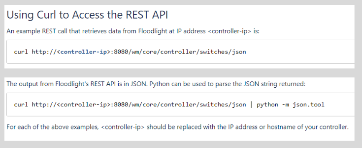

## SDN: Selected Challenges
1. Hardening the control plane
   - Dependable, reliable, performance-scalable, secure distributed system
     - Robustness to failures: leverage strong theory of reliable distributed system for control plane
2. Networks, protocols meeting mission-specific requirements
   - e.g. real-time, ultra-reliable, ultra-secure
3. Internet-scaling: beyond a single AS
4. SDN critical in 5G cellular networks

## OVS Command Reference
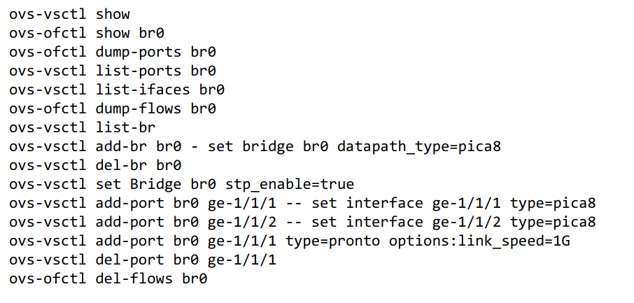