# Transport Layer - User Datagram Protocol(UDP) & Transmission Control Protocol(TCP)

- [Transport Layer - User Datagram Protocol(UDP) & Transmission Control Protocol(TCP)](#transport-layer---user-datagram-protocoludp--transmission-control-protocoltcp)
  - [Process-to-Process Delivery](#process-to-process-delivery)
  - [Transport Layer Port Number](#transport-layer-port-number)
  - [UDP vs TCP](#udp-vs-tcp)
    - [UDP (UDP vs TCP)](#udp-udp-vs-tcp)
    - [TCP (UDP vs TCP)](#tcp-udp-vs-tcp)
  - [TCP Connection Management](#tcp-connection-management)
    - [Rational for using 3-wayhandshake with positive acknowledgment](#rational-for-using-3-wayhandshake-with-positive-acknowledgment)
      - [Delayed SYN Senario](#delayed-syn-senario)
      - [Delayed Data Segement Scenario](#delayed-data-segement-scenario)
  - [TCP Flow Control](#tcp-flow-control)
    - [Sliding-Window Flow Control](#sliding-window-flow-control)
        - [Sender & Receiver Window Overview](#sender--receiver-window-overview)
      - [Example of Sliding-Window Flow Control in Action](#example-of-sliding-window-flow-control-in-action)
  - [TCP Error Control](#tcp-error-control)
  - [TCP Congestion Control](#tcp-congestion-control)
  - [Summary](#summary)

## Process-to-Process Delivery
**Transport Layer** is concerned with **process-to-process** delivery of data between sender and receiver, and hence is only implemented at the **end host**.

## Transport Layer Port Number
To **distinguish** between different processes in a host, there is a need to have an identifier at the **transport layer** called **port number**.

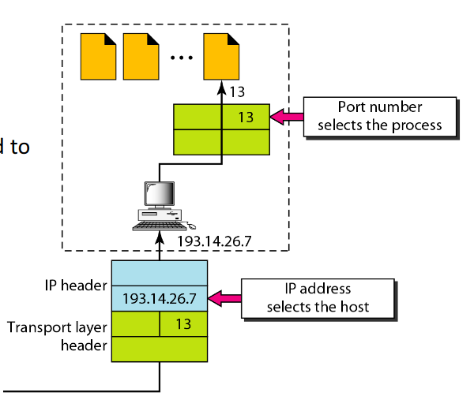

---

Port numbers are implemented as **16-bit** integers, and are divided into **well-known ports**, **registered ports** and **dynamic ports**.

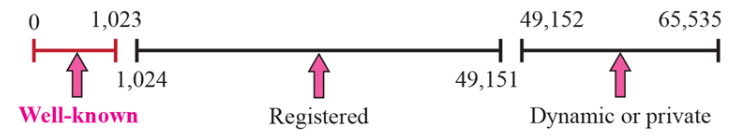

---

1. **Well-known port**: For common services such as HTTP(80), HTTPS(443), DNS(53), etc; Must also be registered with IANA.
2. **Registered port**: For vendor proprietary services such as Cisco P2P Distribution Protocol(4051), etc; Must also be registered with IANA.
3. **Dynamic/Private/Ephemeral port**: For OS to allocate temporarily to client processes when needed.

## UDP vs TCP

UDP - User Datagram Protocol | TCP - Transmission Control Protocol
--- | ---
Unreliable, connectionless | Reliable, connection-oriented
Datagram oriented | Stream oriented
Simple | Complex
Example applications: routing(RIP), DNS, Quote of the day(Qotd), etc. | Example applications: web(http), email(stmp), file transfer(ftp), Qotd, etc.

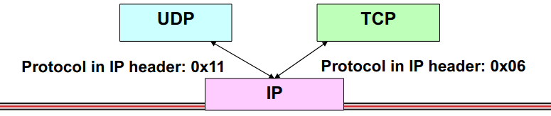

---

### UDP (UDP vs TCP)

UDP is meant to provide fast but unreliable service, and the only service it provides is to add the use of port number for process-to-process communication. Hence, UDP header is simply designed as follows:

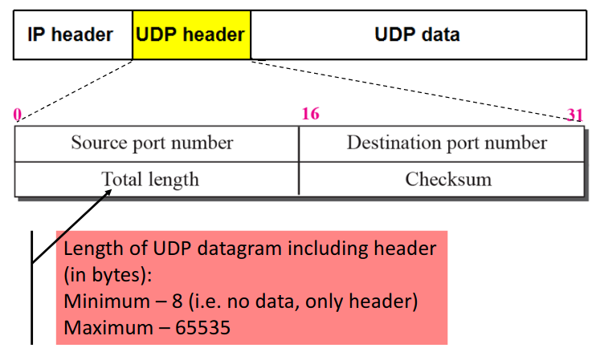

---

UDP provides datagram or connectionless service because each application layer's message is sent as a datagram directly without the need to establish a connection.

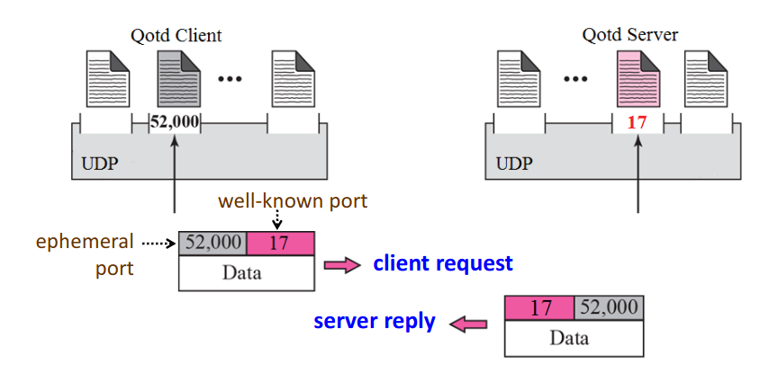

---

### TCP (UDP vs TCP)

In contrast, TCP is meant to provide reliable service over unreliable IP and typically unreliable data link as well. As a result, TCP is complex.

To provide reliable service, TCP implements:
1. **Connection Management** - To establish connection between sender and receiver before transmission of application layer messages.
2. **Flow Control** - To prevent sender from transmitting too fasr and overflowing the receiver's buffer.
3. **Error Control** - To enable sender to **detect** and **correct errors** in transmissions, typically by retransmission.
4. **Congestion Control** - To limit sender from sending too much if the network is already congested.(To be a considerate user of the Internet).

To implement reliable service provided by TCP, the TCP header is designed as follows:
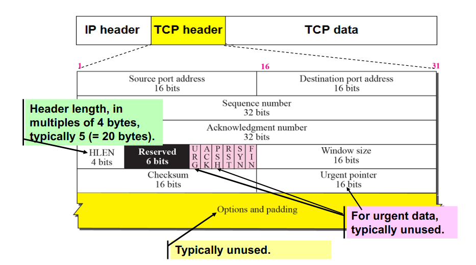

---

TCP is said to provide stream service because application layer messages are sent as a continous byte stream, which is then broken by TCP into segments before sending out.

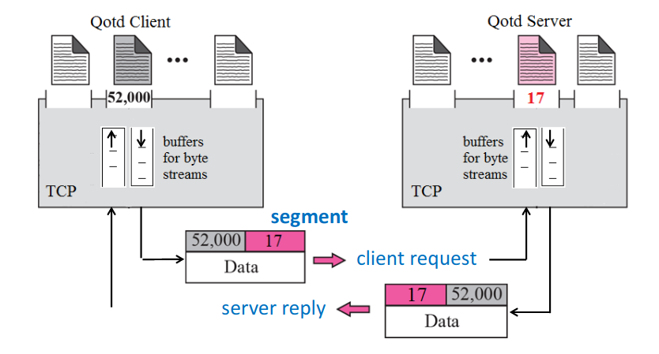

---

## TCP Connection Management
Establish connection between sender and receiver before transmission of application layer messages.

TCP connection-oriented service: To provide reliable service, a TCP connection is established before client and server start communication.

As part of connection establishment, client and server will initialize **2 pairs** of **windows**(**buffer** for byte streams) as follows:

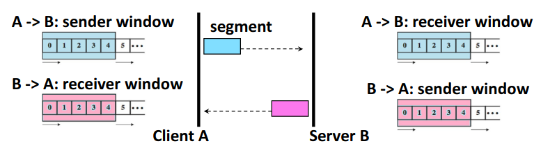

--- 
An **initial sequence number(ISN)** is initialized. Each byte in the byte stream is then **numbered** in **sequence** starting from ISN+1, which will re-start from 0 once reaching $2^{32}-1$; i.e. 1st byte is (ISN+1) mod $2^{32}$, 2nd byte is (ISN+2) mod $2^{32}$, and so on.

An **initial window size** (e.g. 8192 bytes) which indicates the **size in bytes** and the **receiver** is able to **receive** is also initialized.

Specifically, TCP uses a 3-way handshake with positive acknowledge for connection establishment as follows:

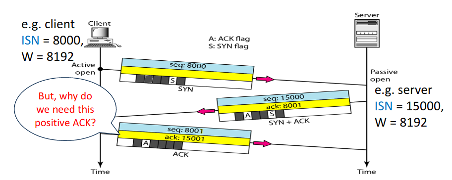

- SYN (S) Flag indicates the start of 3-way handshake;
- ACK (A) Flag indicates receiver is to interpret ACK number;
- **Acknowledgement Number (AN)** indicates the next **sequence number (SN)** expected from sender, and all bytes up to SN-1 have been received correctly (Known as positive ACK).

### Rational for using 3-wayhandshake with positive acknowledgment

To understand the rational for using 3-way handshake with positive acknowledgement for TCP connection establishment, lets consider an example.

If TCP were to use to use a simpler 2-way handshake without acknowledgement:
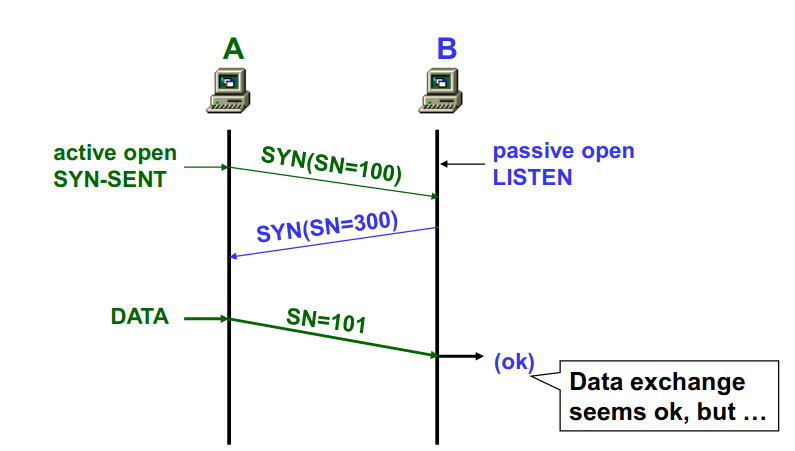

---
#### Delayed SYN Senario
Recall that IP is **unreliable**, and data link is also typically unreliable. It is thus possible for a segment to be delayed, lost, or duplicated due to a timeout signaled by TCP.

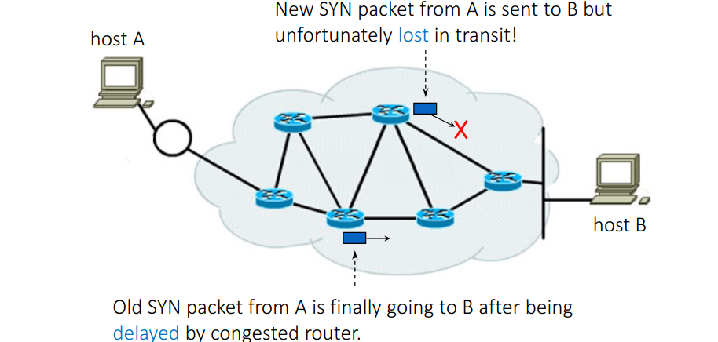

---

If without implementing acknowledgement, an old delayed SYN segment can be mistaken to be valid and cause problem.

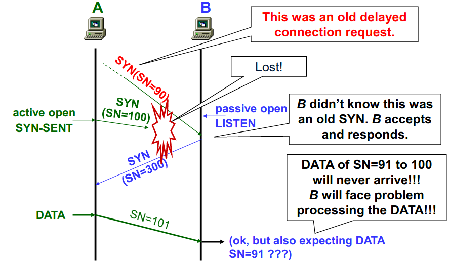

---

Using the same example earlier with 3-way handshake, an old delayed SYN segment can be detected and connection establishment aborted without casuing further problem.

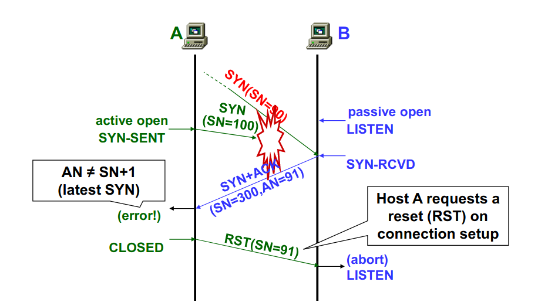

---

Hence, to achieve reliability over unreliable IP, it is necessary to implement acknowledgement, which results in the 3-way handshake for TCP connection establishment.

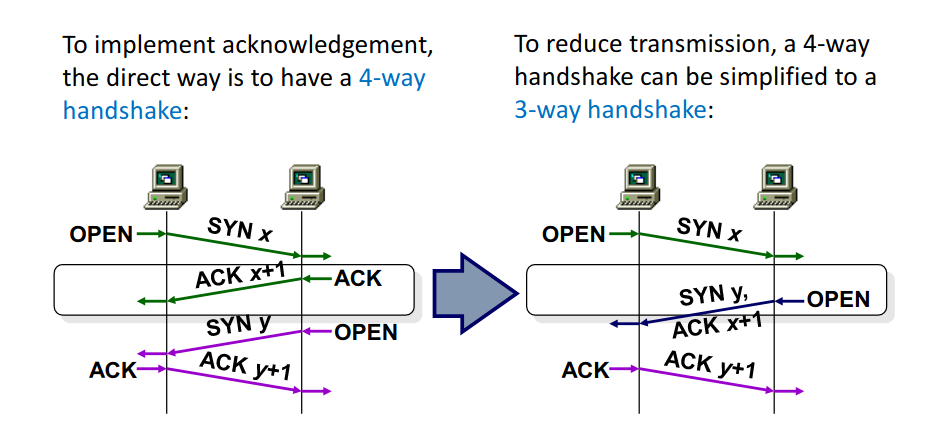

---

#### Delayed Data Segement Scenario
Unfortunately, an old delayed duplicated segment carrying data may still be accepted as valid data in a new TCP connection. 

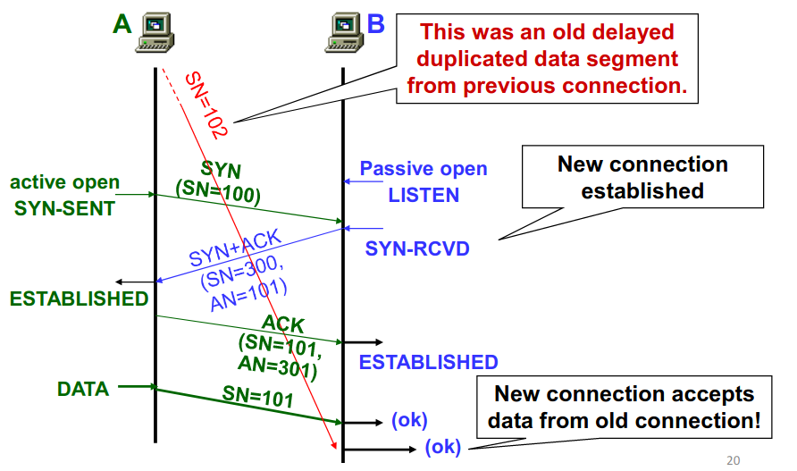

---

Hence, in practice, ISN is incremented by 1 in every 4 microseconds as recommended in RFC 793 to reduce the probability of wrongly accepting old delay duplicated data segment as valid.

By increasing ISN by 1 in every 4 microseconds:
- **One second** of seperation between 2 connections will have a gap of **250,000** in ISN.(Hence, delayed segment from old TCP connection will not be mistaken as segments for new TCP Connection.)
- With a **32-bit SN**, it takes about 4.77 hours for the same ISN to cycle back.(So most likely the old delayed segments with similar SN will no longer exist in the Internet anymore.)

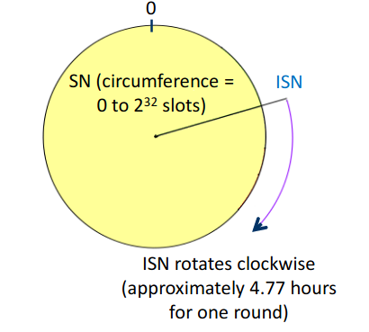

---

## TCP Flow Control
Flow control prevents sender from transmitting too fast and overflowing the receiver's buffer.

### Sliding-Window Flow Control
After successful connection establishment, TCP implements **sliding-window flow control** with positive ACK to prevent sender from overflowing receiver's buffer during data transfer.

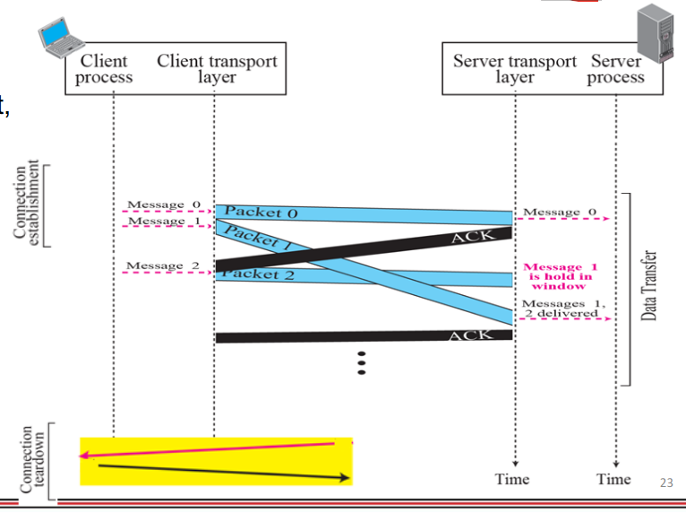

---

##### Sender & Receiver Window Overview
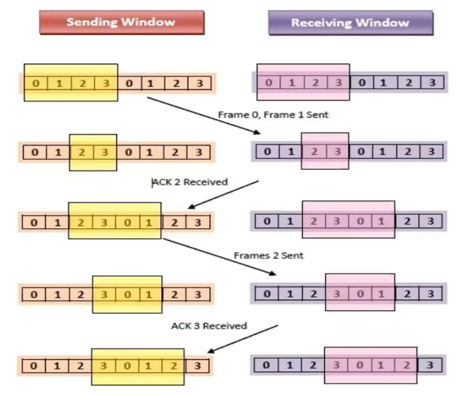

---

In sliding-window flow control, the sender's window size will shrink when bytes are sent, and expand when acknowledgements(ACK) are received.

Sender:
- Maintain a window size representing bytes that can be transmitted without ACK from receiver.
- When bytes are sent, shrink window size from trailing edge.
- **Stop** sending when **window size = 0**.
- When an ACK is received, **expand window size** to **W** bytes(indicating in TCP window size field) starting from acknowledgement number AN.

Correspondingly, the receiver's window size will shrink when bytes are received and expand when acknowledgements are sent.

Receiver:
- Maintain similar window size representing bytes ready to receive.
- When bytes are received, shrink window size from trailing edge.
- if **NOT ready** to receive more bytes, **send ACK** with **W = remaining window size** (in TCP window size field).
- If ready to receive more bytes, send ACK with **W > remaining window size**, and **expand window size** from leading edge accordingly.

#### Example of Sliding-Window Flow Control in Action
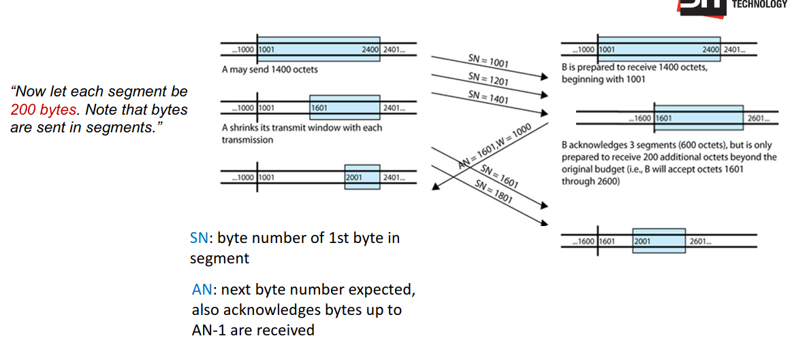

--- 

Since TCP is a 2-way communication, **acknowledgement** is commonly **piggy-backed** onto **data segment** if there is data to be sent in the opposite direction as shown below.

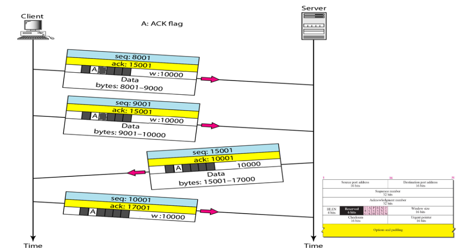

---

If no data segment is available to piggy-back ACK, deyed ACK is to be implemented as recommended in RFC 1122 because it is wasteful to send segment containing ACK only.
1. **Delay** sending **ACK** is immediately(hopefully ACKs can be piggy-backed or combined) but must wait **less than 500 ms**(to avoid error control timeout resend by sender).
2. ACK every alternate segment.

## TCP Error Control
Error Control enables sender to detect and correct errors in transmissions, typically by retransmission.

To handle possible transmission errors due to unreliable IP, TCP implements error control by enhancing sliding-window flow control with Retransmission TimeOut(RTO).

Possible error types:
1. Lost segments:
   - Timeout and retransmit
2. Damaged Segements:
   - Detect based on checksum, discard and wait for timeout retransmit
3. Duplicated Segements(Due to timeout retransmit):
   - Detect based on SN, discard and ACK
4. Out-of-order Segments:
   - Detect based on SN, re-order in buffer and ACK

However, how long should the retransmission timeout(RTO) be? 
- Too short wil result in premature timeout and unnecessary retransmissions
- Too long will result in slow responses.

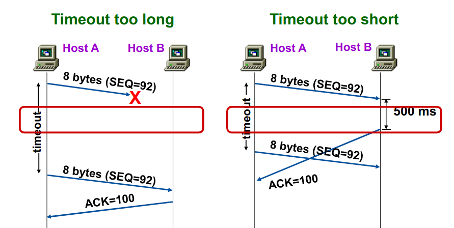

---

In practie, delay is not fixed and hence RTO needs to be **adaptive**. So the solution is to measure the round-trip time(RTT) that a segment is sent until its acknowledge is received.

Typically, TCP only implements **1 timer** for **1 TCP connection**. hence, only **1 RTT measurement** is in progress at a time despite possibly many segments being sent.

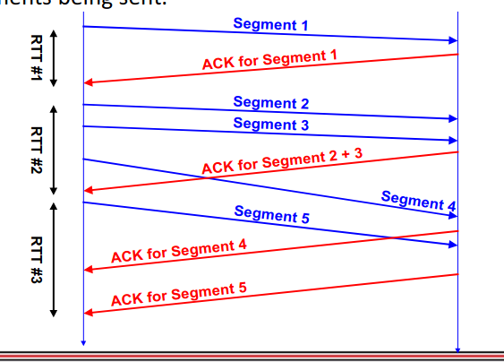

---

Naturally, each measured RTT will vary depending on the changing delay in the network. Hence, another **smoothed RTT(SRTT)** is proposed as an "average" of RTTs.

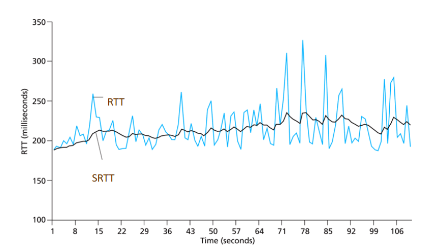

---

To be fast, the delayed ACK in sliding-window flow control is amended to send immiediate ACK for TCP error control if (1) **out-of-order segment is received**, or (2) **segment fills the gap**.

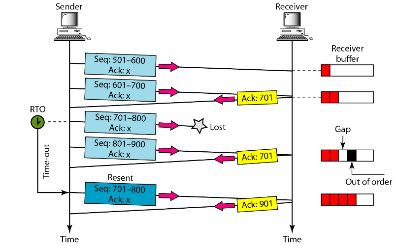

---

Together with **immediate ACK**, **fast retransmit** can be implemented without waiting for timeout if **3 duplicated ACKs** are received as recommended in RFC 5681.

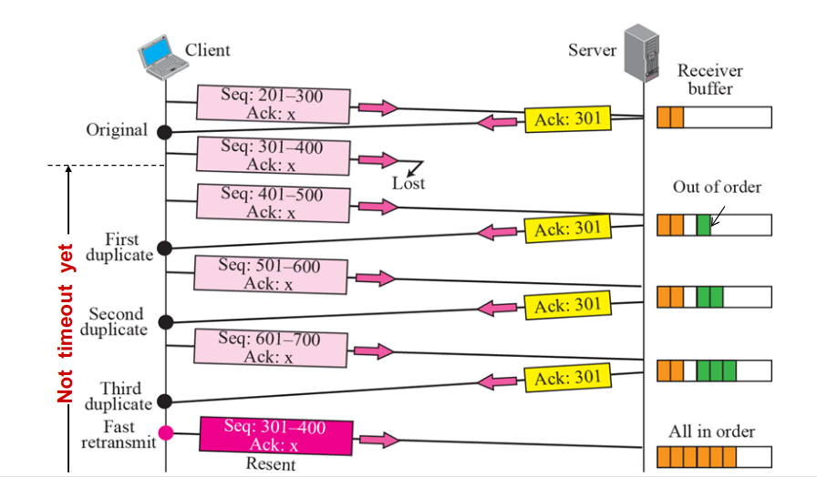

---

Finaly, when both client and server have finished communication, TCP connection closing will be performed using 3-way handshake similar as connection establishment.
- Note that TCP closing can be initiated by client **or** server.

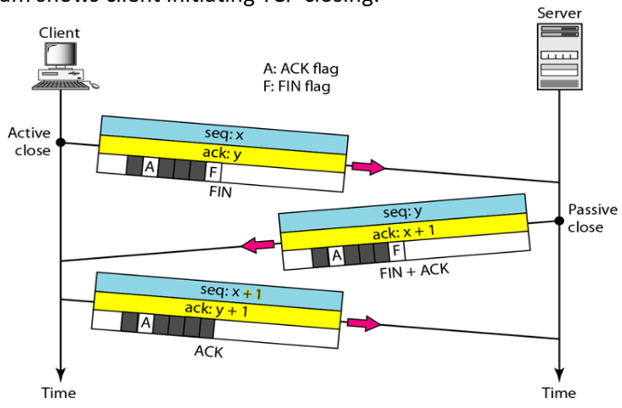

---

Alternatively, since TCP is for 2-way communication, TCP half-close can be performed for a client or server to end its communication first while the other continues sending.

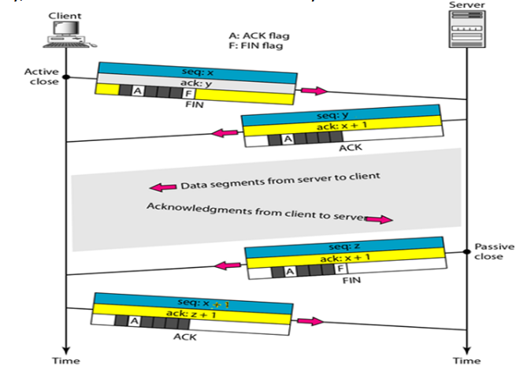

---

## TCP Congestion Control
Congestion control limits sending too much if the network is already congested.

TCP congestion control, which is to be a good user to prevent sender from sending too much to congest the network and possibly causng congestion collapse.

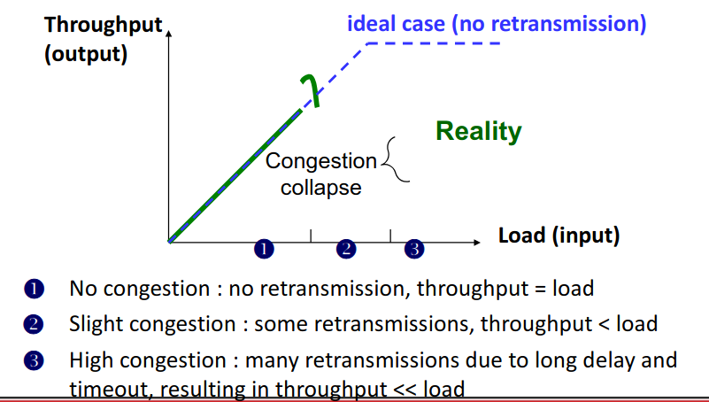

---

With TCP congestion control, data transfer in sliding-window flow control is now divided into **2 phases**: 
- Slow start
- Congestion avoidance

Data transfer will commence at **slow start phase**, transmit to **congestion avoidance phase** and back to slow start when loss occurs.

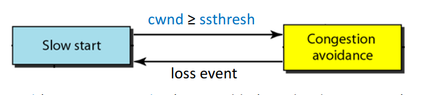

---

1. **cwnd(congestion window)**: A variable(initialized to 1, 2 or 4) which will be incremented when data transfer is successful.
2. **ssthresh(slow start threshold)**: A variable (initialized to large value like 65535) defining the point of transit from slow start to congestion avoidance.

Now, at each **transmission round**, **maximum bytes** that can be sent out:
- min(W, cwnd x MSS)
  - where W = receiver window size, MSS = maximum segment size

During **slow start phase, cwnd** increments by twice for each segment ACKed, which effectively is **increasing exponentially** at each transmission round.

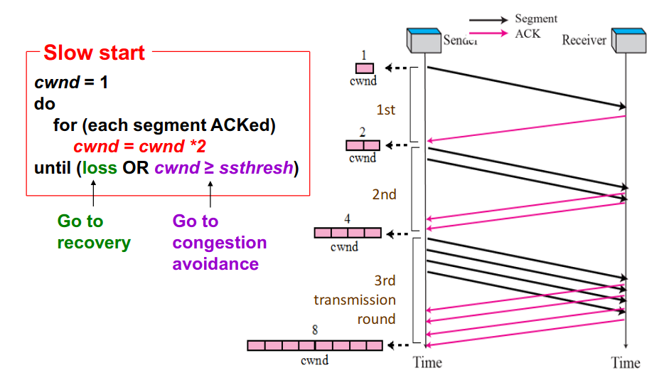

---

During **congestion avoidance phase, cwnd** increments by 1 after all segments within the transmission round are ACKed, which effectively is **increasing linearly**.

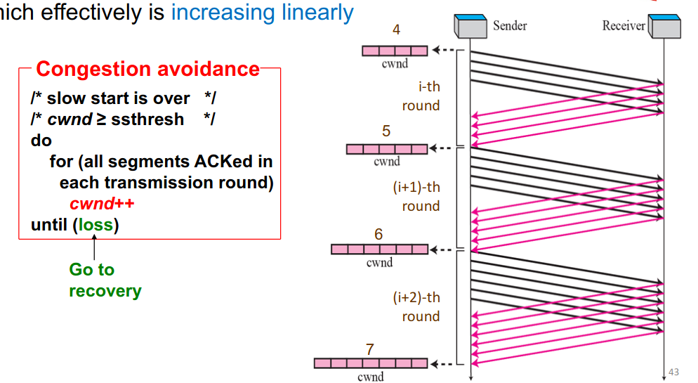

---

If segment loss is encountered during slow start or congestion avoidance phase, **TCP Tahoe algorithm** was once commonly implemented to perform **loss recovery**.

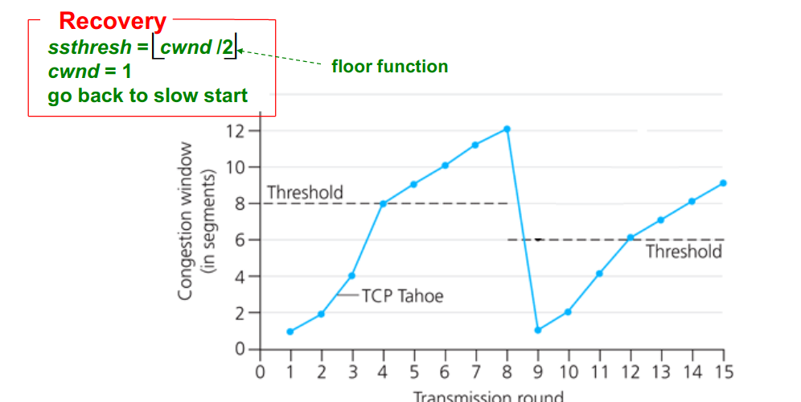

---

Today with the wie adoption of **Fast-retransmit** for error control, an alternative **TCP Reno algorithm** is also commonly implemented.

**TCP Reno algorithm** is also commonly implemented to perform fast recovery.

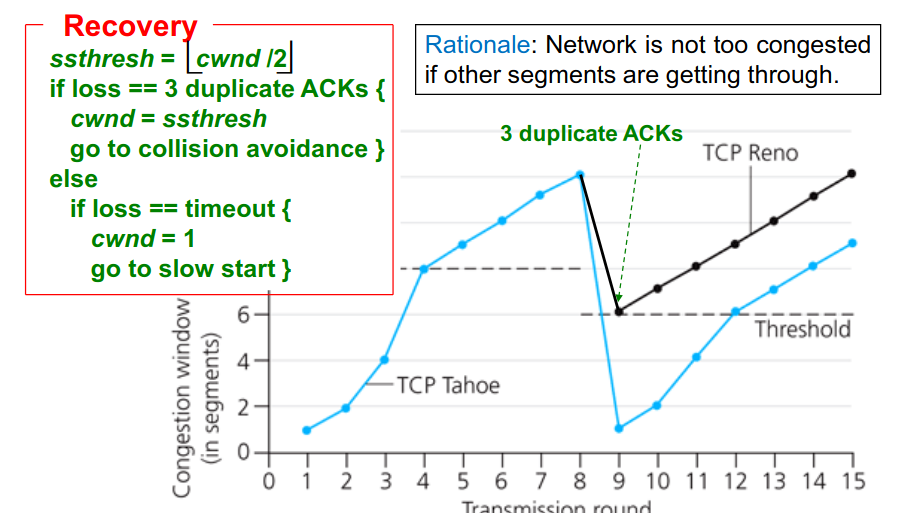

---

## Summary 
1. Transport Layer Protocols:
   - UDP(User Datagram Protocol)
   - TCP(Transmission Control Protocol)
2. UDP provides fast unreliable service
3. TCP provide slow reliable service
   - Connection Management
   - Flow Control
   - Error Control
   - Congestion Control

